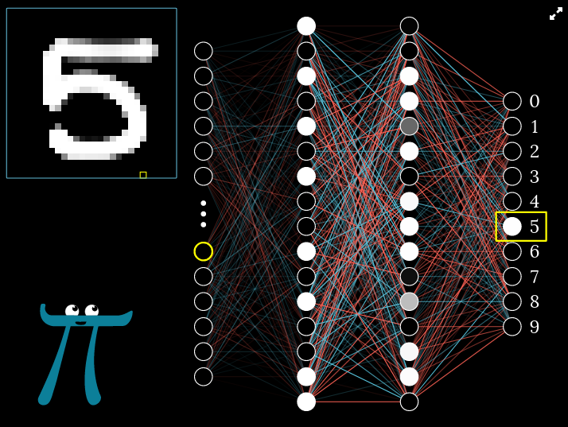
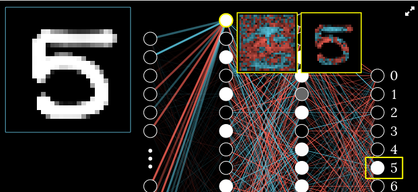
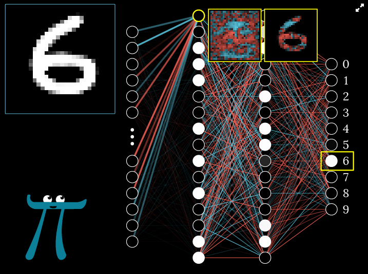
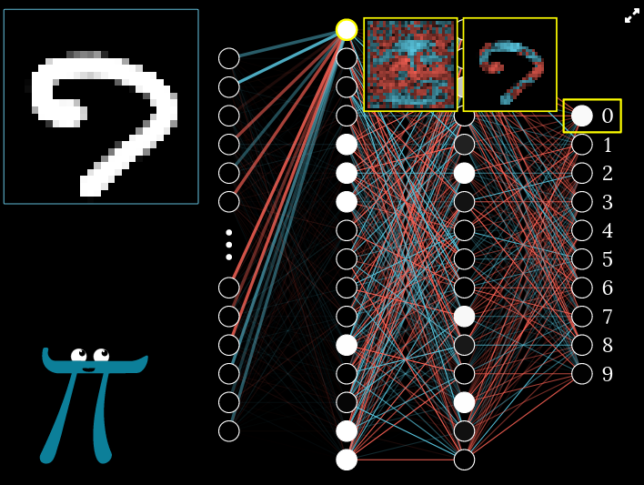
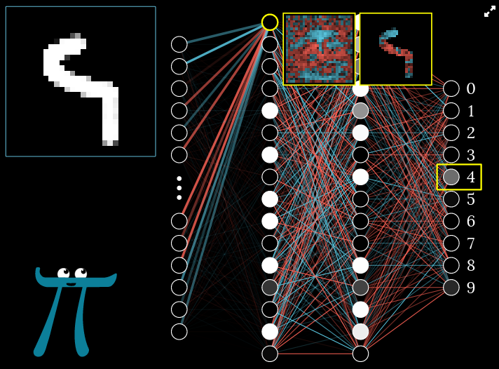

# Neural Network Activity

## Resources
### Read and solve:
- [3blue1brown's Chapter 1: What is a neural network?](https://www.3blue1brown.com/lessons/neural-networks#title)
    - The Structure of a Neural Network
    - Neurons
    - The Hidden Layers
    - Why Use Layers?

## Instructions

1. Hand draw a digit in the first demo box and click "check digit".

    
    

2. Click on several of the input nodes (first layer) and see a corresponding pixel light up yellow on your input digit.

    

   - If you had to guess, describe in English one possible connection between nodes and pixels.
   
   Each node is a pixel.
   
3. Click on several of the hidden nodes (second layer) and see two images pop up, one with all red/blue pixels, and one
    masked to just your hand drawn digit.
    - If you had to guess, describe in English what the two images might mean.
   
   
   The first image is a heatmap of the individual pixel (1 of 784), the second image is the heatmap of the whole image grid.
   
    - See the incoming edges light up between your selected nodes and the input nodes in the first layer.
      - What does a bright blue edge mean in terms of the numerical weight on that edge? Is it less than zero, greater 
        than zero, or equal to zero?
      
      Blue is positive, greater than 0.
      
      - What does a bright red edge mean in terms of numerical weight on that edge? Is it less than zero, greater than
        zero, or equal to zero?
      
      Red is negative, I think in this case it is equal or close to zero because of the range of weights.
      
      - Answer the above questions for a slightly blue or slightly red edge.
      A blue edge would be positive and closer to 1.0, a red edge would be negative and closer to 0.
      
4. Click on your hand drawn digit to reset the demo and draw a new digit.

    - Click on some hidden nodes (second layer). Do you think the color (weight) of these edges are the same as your
      previous digit?
   
      I think they are visually the same but without the numerical weights I wouldn't know.
   
   
    - Reset the demo and draw another digit to test your theory.
   
   
    - Whether it's the same or different, describe in English why this is the case.
   
      I am going of what I can easily see in the image. The connections to from the first nodes (representing pixels)
      to the first layer of hidden nodes, appear to have the same/similar edges in all the images. It's impossible to
      know for sure without seeing the actual weights.
   
5. Reset the demo and draw a digit to be as ambiguous as possible (e.g. halfway between a 4 and 9).
    - Run the network forward to check the digit. See if you can get a halfway gray color between two or more output 
      nodes (in the last layer), indicating uncertainty.
   
   
   
   This is the best I could do:
   
    - What would you do in this case, if you needed this network to classify the digit definitely? (e.g. for the U.S. 
      Postal Service)
   
      In my case the weights skewed 4, so I would go with that. I'm not sure if I think when we get down to these types 
      of problems we overemphasize perfection. In terms of the U.S. Postal service how important is it that we don't 
      have a human for edge cases or 50/50 splits? Do we want to be at a point where there is no human oversight?
    
6. A machine learning model is trained from data, like a binary executable file is compiled from source files.
    - In what ways could this be a valid analogy? Consider this prediction:
      
      Based on this assignment, similarities are intermediate stages, transformation, dependencies, and reproducibility.
    
      - If I give you a binary executable program which doesn't need the internet to run (for example, a tic-tac-toe 
        toe game), and you air gap yourself from the internet, do you have everything you need to run the game?
      
        Yes, as long as the game doesn't require any external resources. 
        
      - If I give you and ML model and all input images that I need to have classified on the same computer, and you 
        air gap yourself from the internet, do you have everything you need to classify the input images?
      
        Yes, as long as the ML model doesn't require any external resources. Everything would have to be locally 
        available (seems hard depending on the domain of the ML model).
   
    - Name some differences in this analogy; that is, how is an ML model trained from data different from a compiled
      binary file?
      
      - ML models have an adaptive learning process, binary files are static.
      - ML models generalize patterns from the training data and look for relationships that can be applied to new 
        instances, binary files are specific to the task they were written for.
      - ML models can be retrained without starting over using more/updated data, binary files can be modified and a
       recompiled (making a completely new version).