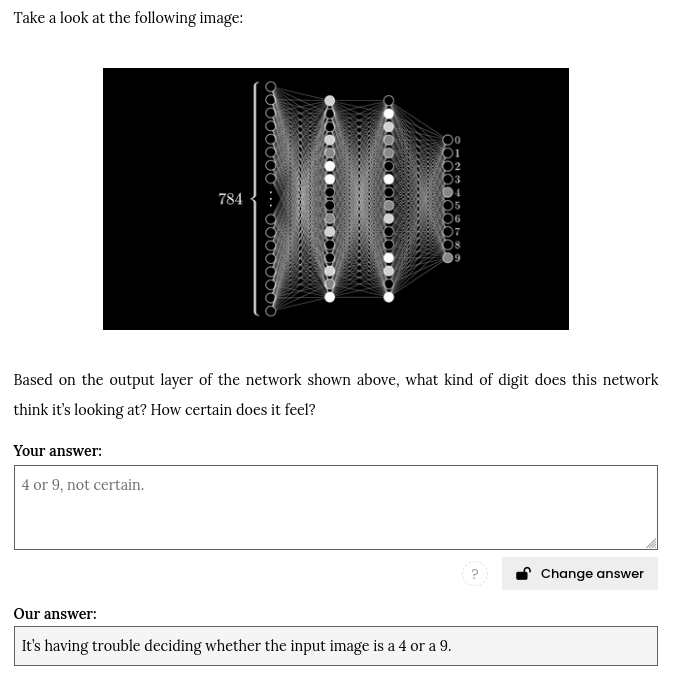
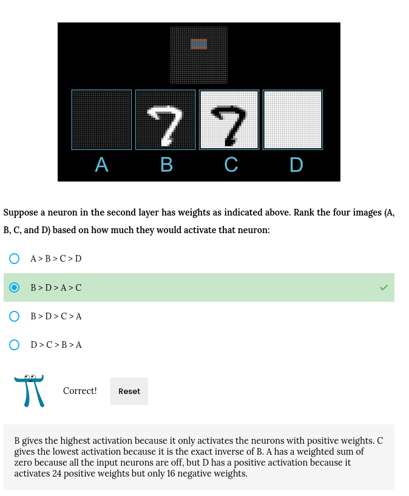
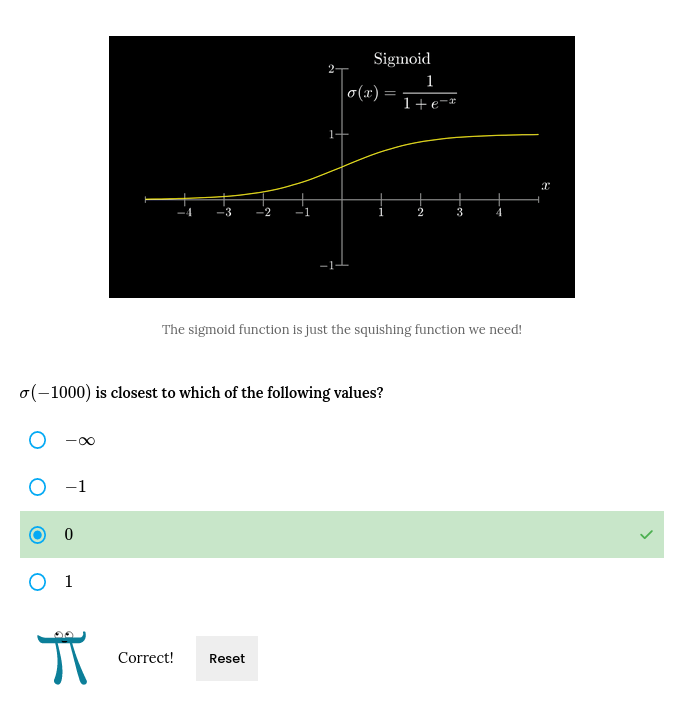

# AI Self-Hosting In Class, Sprint 2024

## Week 02 Wednesday Morning, 2024-04-10**

### Objectives:
[AI-24sp Morning Notes](https://github.com/TheEvergreenStateCollege/upper-division-cs/wiki/AI%E2%80%9024sp%E2%80%902024%E2%80%9004%E2%80%9010%E2%80%90Morning)

### What we covered:
[3blue1brown](https://www.3blue1brown.com/lessons/neural-networks#neurons)

### Activities
- Quizzes on [what we covered](./2024-04-10&11ai_in_class.md#what-we-covered)

1. 
2. 
3. 

- Notebook work
[numpy_arrays](./jupyter_lab_notebooks/in_class_2024-04-10-1.pdf)

- Prep work for Thursday:
  "In lab tomorrow, we'll continue to type and complete the network.py Python class and script for running MNIST training.
  In particular, we'll need to finish writing our own data loader https://github.com/3b1b/videos/blob/master/_2017/nn/mnist_loader.py#L72-L80"

## Week 02 Thursday Afternoon, 2024-04-11

### Objectives:

[Monday Afternoon Notes](https://github.com/TheEvergreenStateCollege/upper-division-cs/wiki/SC%E2%80%9024sp%E2%80%902024%E2%80%9004%E2%80%9008%E2%80%90Afternoon)

### What we covered:

## Activity 

### [DUE: 4/11 Homework 01](https://github.com/TheEvergreenStateCollege/upper-division-cs/wiki/AI‐Homework‐01)
