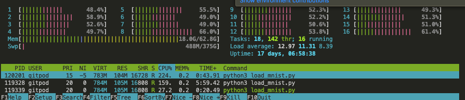

# prototype-00 Dev Diary

## 2024-04-11 ppham

Added back loading of all training images and labels to load_mnist.py
and also loading of test images and labels.

Created numpy arrays from them, and printed out their shape to verify.
I added in the comments the expected shapes:

(60000, 784, 1) for images
(60000, 10) for labels that have been encoded into one-hot vectors

I zipped them together into (x,y) image and label training pairs
because that is what the neural network expects, based on the
original Mike Nielsen loader.

I don't have a working `network.py` yet, so I'll need help from
others to test it. I'll keep working on the `Network` class
so I can test it myself.

You can run it like
```
python3 load_mnist.py
```

with these files downloaded and gunzipped from Yann Lecun.

```
-rw-r--r-- 1 gitpod gitpod 7.5M Jul 21  2000 t10k-images-idx3-ubyte
-rw-r--r-- 1 gitpod gitpod 9.8K Jul 21  2000 t10k-labels-idx1-ubyte
-rw-r--r-- 1 gitpod gitpod  45M Jul 21  2000 train-images-idx3-ubyte
-rw-r--r-- 1 gitpod gitpod  59K Jul 21  2000 train-labels-idx1-ubyte
```

The need to wrap the result of `zip`
with a `list` is to force it to be a collection, like `.collect` in Rust.

Apparently this behavior changed from Python2 to Python3

```
In Python 2, zip() returns an actual list which is not very efficient if you work with a large amount of data. For this reason, in Python 3, zip() returns an iterable which produces the result on demand.
```
https://thepythonguru.com/python-builtin-functions/zip/

Debugging with Gavin, it turns out it was a mistake to one-hot encode the
training labels (and the test labels), because the comparison with the
result (or activation) of feedforward expects it to be a single character,
like in the original Lecun file.

```
def evaluate(self, test_data):
        """Return the number of test inputs for which the neural
        network outputs the correct result. Note that the neural
        network's output is assumed to be the index of whichever
        neuron in the final layer has the highest activation."""
        test_results = [(np.argmax(self.feedforward(x)), y)
                        for (x, y) in test_data]
        return sum(int(x == y) for (x, y) in test_results)
```

I've fixed this in `load_mnist` by removing the call to `one_hot_encode_from_label`

### Python3 Version of Mike Nielsen Code is already available

I just found the official Mike Nielsen github code for the textbook

https://github.com/mnielsen/neural-networks-and-deep-learning

and there is already a Python3 version with CUDA

https://github.com/MichalDanielDobrzanski/DeepLearningPython

I suppose it made things harder to do our own MNIST loader, but I also
wanted to understand the dimensionality of the data at a deeper level,
and to also be able to dump / pickle the model.

So I'm satisfied with the harder way we took, I just want better quiz questions
and exercises to make what's happening inside this neural network more clear
(and visual).

### List of Python2 Fixes

* `xrange` in Python2 is just `range` now in Python3
* `print()` instead of `print`
* `f"{var}"` format strings instead of `"{0}".format(var)`



## 2024-04-04 ppham 

Following these course notes.

https://github.com/TheEvergreenStateCollege/upper-division-cs/wiki/AI%E2%80%9024sp%E2%80%902024%E2%80%9004%E2%80%9004%E2%80%90Afternoon

I typed in the `load_images.py` and `load_labels.py` script
from the course notes, and got partway through `network.py`.

I didn't have time to type the `SGD` and `backprop` functions yet, anything after it. These will need to be done by the next
team (thanks next team!)

Currently, I'm working on update the old loader from
Mike Nielsen to use the
original Yann LeCun file format

https://github.com/mnielsen/neural-networks-and-deep-learning/blob/master/src/mnist_loader.py#L47

From these lines, it expects a 3-tuple

```
(training_data, test_data, validation_data)
```

where each of `*_data` is, according to the comments

``x`` is a 784-dimensional numpy.ndarray
    containing the input image.  ``y`` is a 10-dimensional
    numpy.ndarray representing the unit vector corresponding to the
    correct digit for ``x``.
```

There is a utility method for turning a single-character label
`y` into a "one-hot" encoding of a 10-element Numpy array,
where one element is 1.0 and the others are 0.0

```

```

This splits up the Yann LeCun data, which was
originally 60,000 training data and 10,000 test data,

into 50,000 training data, 10,000 validation data,
and 10,000 test data.