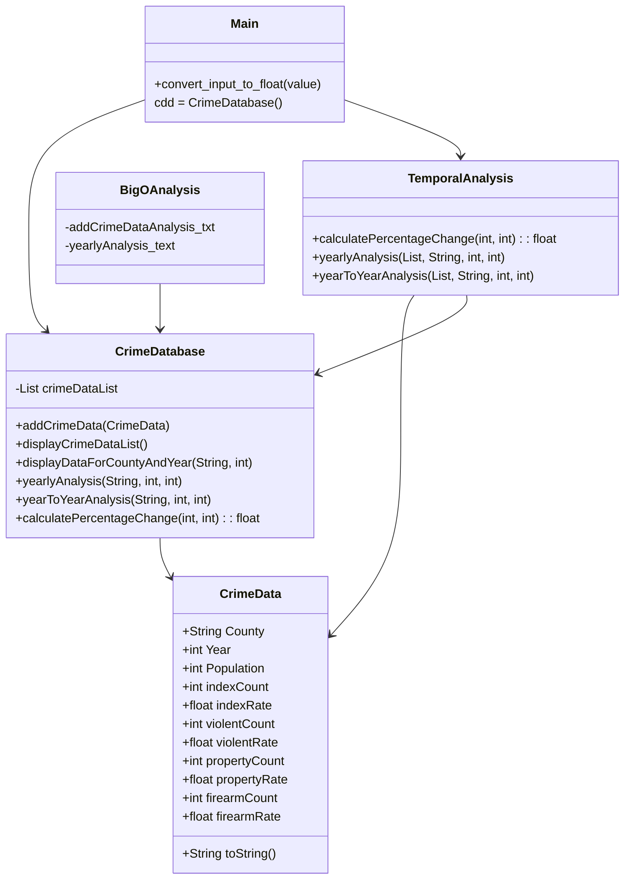

# Inspiration

At the beginning of the course, I struggled on trying to find data that would be interesting from a personal level but also from a technical level as well. At first I was very intrigued by the spotify data project that some of my fellow classmates were working on. After many weeks of debate, I decided to generally split from that group and focus on data that would grab my attention. With this in mind, I chose to work on crime data specifically the state of New York. I chose New York in particular becuase of the availabilty and vast quantity of data that the Division of Criminal Justice Services has that is ready to be accessed by the public. The data they have also goes back 20 years so that will allow to perform temporal analysis to see how crime trends have changed over the years that this data has been taken. 

# Mermaid Diagram 

    

# How to run our demo on our included data
Currently, we run our demo with our included data by going into `main.py` and running the method. That takes us through our menus to and allows the main method to access other dependencies and packages throughout the project particularly `crime_database.py` and  `temporalanalysis.py`. We are storing our crime data in a seperate file so that the database doesnt get overcrowded with information. //FIXMEEEEEEEEEEEEEE

# Tech Stack for New York Crime Database

## 1. IDE:
    * GitPod: Most of the development for this project was done mostly on GitPod. It was very helpful and convienient for this class because of its cloud based capabilites. Through the progress of this project, switching to VS code proved to be more comfortable for me as a developer. Personally for the future programs, If I can utilize the dev pack for github next quarter on VS code, I believe I may switch because of my familiarity and I dont like using browser IDEs. 

## 2 Programming Language/Formats:
    * JavaScript: OOP and dynamic programming for this project (Java 20).
    * Python: After many issues with Java I decided to really challenge myself and try out Python for this project.
    * CSV: This is the format that I turned my dataset into.
    * Mermaid: Used to set up UML diagram of my project

## 3. Version Control:
    * Git: Use Git for version control, tracking changes in your code.

## 4. Build Automation:
    * Maven: The core tool for managing the build lifecycle, dependencies, and project structure.
    * Dependency Management: 
     Apache Maven Dependency Plugin: Used for managing project dependencies.
     Apache Maven Shade Plugin: Bundles project dependencies into a single, executable JAR file.
    * Testing Frameworks:
     JUnit: A widely used testing framework for Java.
     TestNG: An alternative testing framework with additional features like parallel test execution.

     !!!!NOTE!!!
     After the switch to Python I believe that I may use package cloud for build automation but I will continue to use maven for java projects.

# Challenges that I ran into

The biggest challenge that I ran into with this project was trying to find crime data that reflected trends regarding certain demographics such as age, sex, race, income, education, etc. My initital plan was to use census data to somehow pinpoint those trends. However not a lot of the Census data is split by county and even then that is just bad data usage. It would paint a blurry picutre of these connections if one at all.

Another Challenge that I faced while completing this project was trying have my project read from the csv file. With Pauls Help, i was able to integrate into the `main` method in `CrimeDatabse` the ability to read the csv file. 
    
Dynamic Programming Skills:
   -I found the implementation of dynamic programming concepts challenging. Understanding and applying dynamic programming in Python required a deep understanding of recursion, memoization, and bottom-up approaches.
   -I struggled with breaking down complex problems into simpler subproblems and figuring out the optimal substructure to build dynamic programming solutions.

CSV Reading:
   -CSV reading posed some difficulties for me. I had to familiarize myself with Python's CSV module and understand how to efficiently read and process data from a CSV file.
   -Dealing with headers, handling missing or inconsistent data, and converting data types from strings to appropriate types added an extra layer of complexity.

Type Rules:
   -Managing and enforcing type rules in Python, especially when dealing with user input or reading data from external sources like CSV files, was challenging.
   -I encountered issues with data types, such as converting strings to integers or floats, and ensuring that the data used in calculations adhered to the expected types.

Package Structure and OOP:
   -Structuring the project into packages and implementing object-oriented programming (OOP) concepts required careful thought and planning.
   -I faced challenges in organizing classes, defining relationships between them, and ensuring that the overall design was modular and maintainable.

Multiline Text and Documentation:
   -Writing multiline text for methods and documenting the code was a struggle. Clearly explaining the logic, time complexity, and space complexity in a concise yet informative manner required a balance that I found challenging to achieve.

Mermaid Syntax:
   -Creating a Mermaid flowchart and ensuring the correct syntax for depicting relationships between classes in VS Code was a new experience. I had to learn and apply Mermaid syntax effectively.

Personal Coding Style:
   -Maintaining a consistent and clean personal coding style across multiple files and packages was important but challenging. Deciding on naming conventions, indentation, and commenting required attention to detail.

Despite these challenges, tackling them head-on has undoubtedly improved my Python programming skills and deepened my understanding of dynamic programming, data manipulation, and project organization. Each struggle became an opportunity for growth and learning.

# Accomplishments/What I learned
## 1. Java
Overall with this final project, it really allowed me to see how important dynamic programming is. I am also very happy with how organized and concise my project is. Last year and beginning of this quarter, I was a very messy programmer. This meant awful spacing, lack of succinct comments, wrong indents, and various syntax errors. This are skills that I have been able to fix by working on this project. I am also proud of my knowledge of the JavaScript langauage and its numerous libriaries. Working on this project as well as lectures throughout the quarter has immensely soldified my skills in java. With `CrimeDatabase`, I have utilized all the skills that I have learned from this quarter whether it is using HashMaps or dictionaries and trying to calculate the runtime of these methods and algorithms. This is more of a note for me but I want to really get into learning Python for these next quarters. A lot of the things that came with coding (Ex: recongnizing when to initialize a new HasMap and recognizing how to connect code with design) has become almost second hand nature to me.

 
## 2. Python
Dynamic Programming Mastery
   -I successfully grasped the intricacies of dynamic programming. Overcoming the initial challenges, I now feel confident implementing recursive solutions, memoization, and bottom-up approaches to solve complex problems efficiently.

CSV Handling Proficiency:
   -I triumphed over the complexities of CSV reading. From understanding Python's CSV module to handling headers and converting data types, I can now adeptly read and process data from CSV files, making data manipulation a smoother process.

Type Rules and Data Integrity:
   -I conquered the challenges associated with Python's type rules. Handling data types, especially converting strings to integers or floats, became second nature. Ensuring data integrity in calculations is now a strength, and I can confidently enforce type rules.

Effective Package Structure and OOP Design:
   -I successfully organized the project into packages and implemented sound object-oriented programming principles. Defining class relationships and creating a modular, maintainable design showcase my newfound proficiency in project structuring.

Clear Multiline Text and Documentation:
   -I honed my skills in writing clear and concise multiline text and documentation. Articulating complex logic, time complexity, and space complexity in a way that is both informative and approachable is now a strength in my coding repertoire.

Fluent Mermaid Flowchart Creation:
   -I delved into creating Mermaid flowcharts and established fluency in the syntax. Visualizing relationships between classes in VS Code is no longer a challenge, and I can effortlessly represent project structures using this powerful tool.

Consistent Personal Coding Style:
   -I achieved a harmonious and consistent personal coding style across multiple files and packages. From naming conventions to indentation and commenting, my code now reflects a polished and professional coding style.

Problem-Solving Resilience:
   -Each challenge became an opportunity for growth, strengthening my problem-solving skills. The ability to tackle new concepts and overcome hurdles is now ingrained in my approach to coding, making me a more resilient and resourceful programmer.

In this project, I didn't just write code; I embraced challenges, learned new skills, and emerged with a heightened level of confidence in tackling real-world programming complexities. This journey was not just about the code itself but about personal and professional growth.

# Whats next?????
 

Crafting a User-Friendly Experience:
   As I delve into this project, my vision is to enchant users with a seamless journey through the crime data. Picture this – a web-based dashboard or a sleek desktop application where users, like myself, can intuitively interact with the data, almost like exploring the hidden corners of a well-designed city park.

Bringing Data to Life with Visualization:
   I want to infuse life into the data, turning it into a visual masterpiece that even someone unfamiliar with the dance of data can appreciate. Picture me using tools like Matplotlib, Seaborn, or Plotly in Python as my paintbrushes, creating dynamic charts and graphs that tell a story – a story that's not just about numbers but an artistic interpretation of crime trends.

Predicting Tomorrow's Story:
   Imagine if I could use machine learning algorithms to predict the future of crime rates based on historical data. It's not just about analysis; it's about forecasting a narrative that impacts law enforcement and policymakers. I envision turning insights into proactive measures, creating safer communities – a storyline that transcends the limits of present-day data.

Mapping Crime's Heartbeat:
   Geospatial analysis, for me, adds a touch of adventure to the project. I envision crime hotspots lighting up on a map like stars in the night sky. It's not just about seeing numbers; it's about feeling the pulse of areas with higher crime rates, guiding law enforcement like a compass to where it's needed most.

Empowering Users with Filters and Sorts:
   Think of it as giving users, including myself, a magic wand to summon the exact data they need. Filters and sorts transform complexity into simplicity, allowing users to sculpt the data landscape to match their queries. It's not just about data manipulation; it's about putting me in control of my investigative journey.

Exporting Insights, Sharing Stories:
   Imagine me waving a wand to export my findings into PDFs or Excel sheets, creating shareable stories. It's not just about analysis; it's about empowering me to share my discoveries with colleagues, stakeholders, or anyone curious about the narrative the data tells.

Securing the Castle:
   For a project meant for many, I want to fortify it with user authentication and authorization – a digital drawbridge to ensure data security. It's not just about access; it's about tailoring the experience, letting users, including myself, explore based on our roles in the kingdom of crime data.

Harmonizing with External Data Sources:
   Imagine me weaving external data sources into the tapestry, enriching the story of crime rates with demographic or economic data. It's not just about crime numbers; it's about creating a comprehensive understanding, exploring how external factors influence the plot.

A Symphony of Refinement:
   I see this project as a living entity, evolving with each interaction. Regular updates and refinements, like tuning an instrument, ensure the project harmonizes with the ever-changing needs of its users. It's not just about development; it's about creating a masterpiece that stands the test of time.

Guiding Users with Documentation and Tutorials:
    Think of it as creating a treasure map for users, including myself, to navigate the project effortlessly. Documentation and tutorials become the compass, making it easy for newcomers to embark on their exploration. It's not just about information; it's about guiding users, and yes, myself, on an adventure through the world of crime data.

