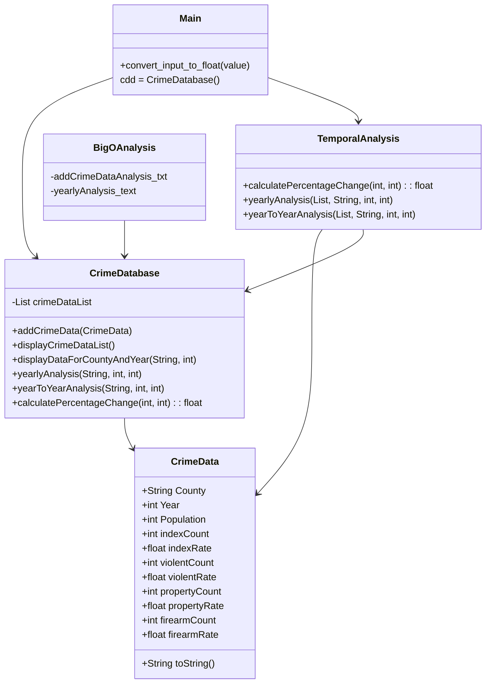

```mermaid
classDiagram
    CrimeData 
    CrimeData : +String County
    CrimeData : +int Year
    CrimeData : +int Population
    CrimeData : +int indexCount
    CrimeData : +float indexRate
    CrimeData : +int violentCount
    CrimeData : +float violentRate
    CrimeData : +int propertyCount
    CrimeData : +float propertyRate
    CrimeData : +int firearmCount
    CrimeData : +float firearmRate
    CrimeData : +String toString()

    class Main {
        +convert_input_to_float(value)
        cdd = CrimeDatabase()
    }
    
    class CrimeDatabase {
      -List<CrimeData> crimeDataList
      +addCrimeData(CrimeData)
      +displayCrimeDataList()
      +displayDataForCountyAndYear(String, int)
      +yearlyAnalysis(String, int, int)
      +yearToYearAnalysis(String, int, int)
      +calculatePercentageChange(int, int) : float
    }

    class TemporalAnalysis {
      +calculatePercentageChange(int, int) : float
      +yearlyAnalysis(List<CrimeData>, String, int, int)
      +yearToYearAnalysis(List<CrimeData>, String, int, int)
    }

    class BigOAnalysis {
      -addCrimeDataAnalysis_txt
      -yearlyAnalysis_text
    }

    CrimeDatabase --> CrimeData
    TemporalAnalysis --> CrimeData
    TemporalAnalysis --> CrimeDatabase
    BigOAnalysis --> CrimeDatabase
    Main --> CrimeDatabase  
    Main --> TemporalAnalysis  
```
    
