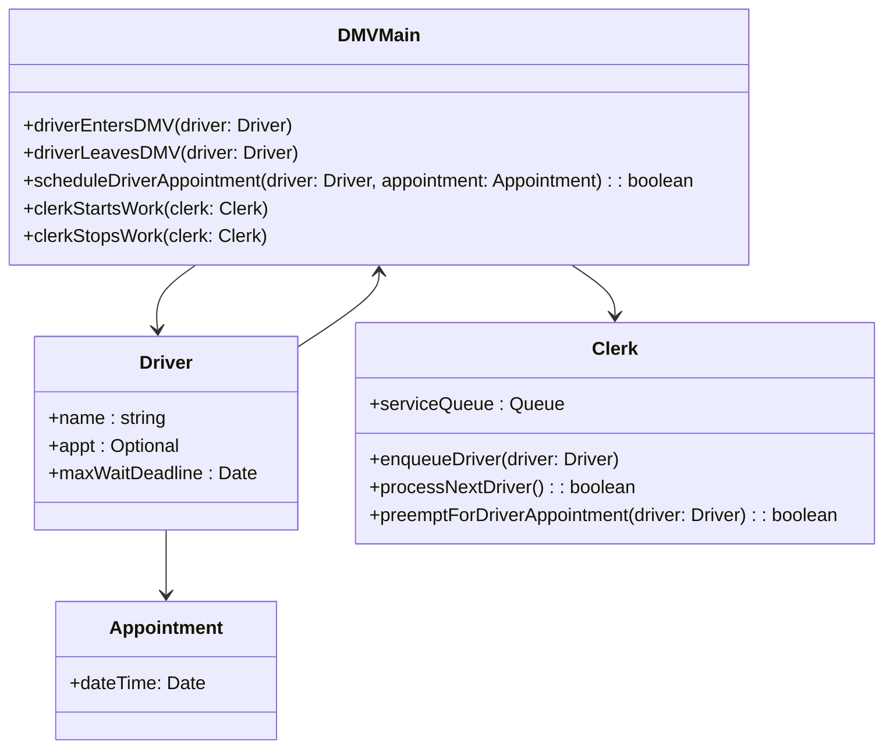

# Assignment Week 9

(100 points total)

For all work on your final project below, commit these code changes to your project directory in
`java-dsa` or `python-dsa`, depending on which language you are using.

This assignment is mirrored in the following locations. They are identical, and you can read either of them to get complete information for completing the assignment.

[Link to public course website.](https://theevergreenstatecollege.github.io/upper-division-cs/dsa-23au/week-09/Assignment-09/)

[Link to GitHub markdown file.](https://github.com/TheEvergreenStateCollege/upper-division-cs/blob/main/dsa-23au/docs/week-09/Assignment-09.md)

[Link to Canvas assignment (mirror)](https://canvas.evergreen.edu/courses/5926/assignments/110976).

This assignment can be completed either using [Traditional Textbook Readings / GitHub Pull Requests](#path-1-traditional-textbook-readings-and-github-pull-requests), or using [zyBooks](#path-2-zybooks). You only have to choose one path.

## Path 1: Traditional Textbook Readings and GitHub Pull Requests

This week's reading and co-creation assignment has five parts, with point values for each part listed after each heading. They total up to 70 points.


### 1. Readings
(20 points)

Complete [Readings-09.md](Readings-09.md) and add your responses to [Co-Creation-09.md](Co-Creation-09.md).

### 2. Final Project Documentation
(10 points)

Create a README.md in your project directory describing your project and how to demo it, so that
one of your classmates can completely duplicate your two operations, on the limited CSV data you can
commit into the class monorepo. Follow the template from Devpost Hackathons:

```
Inspiration

Software Design Diagram (see the next problem)

How to run our demo on our included data

How to run our tests and what they mean

How we built it (your tech stack)

Challenges we ran into

Accomplishments that we're proud of

What we learned

What's next for the project next quarter (as an app engineered for the web)

```

### 3. Final Project Software Design Diagram
(10 points)

Create a mermaid class diagram showing how three of your Java classes relate to one another, and their fields.

[The Mermaid tutorial on class diagrams provides a short background on Unified Modeling Language (UML)](https://mermaid.js.org/syntax/classDiagram.html)
and how to use them to represent how your Java classes (and their members and methods) relate to one another.

#### Example

Here's an example of a diagram you would place into your README.md, created in the previous problem, at the appropriate section.
Create one similar to it, both a Mermaid diagram, and a text description describing how the classes relate to one another.



In this example, `DMVMain` represents our top-level data structure.
A software user calls it to register when `Driver`'s enter it to begin
waiting, either for an appointment or whenever the next `Clerk` can see them.
A software user also calls it to start a `Clerk` working for the day, or
to call it quits at the end of the day. The `DMVMain` contains an internal
event loop that checks the time regularly, and when an appointment time
comes, it pre-empts the `Clerk` with the shortest queue to take that
driver.

#### Some Ways To Think of Design Diagrams

You can think of UML as a "visual pseudocode", and another method for two humans
to communicate on what code to write to solve a problem, or how code works that
has already been written.

UML can be translated into running code, just like pseudocode can,
and you can also diagram your existing source code back to UML to communicate
with yourself and to another programmer.

A picture may be worth a thousand words easily, when that picture is a UML
diagram with 5 or more classes that might take multiple paragraphs to describe
fully.

This is for an object-oriented paradigm.
I don't know of a widely-used (or even infrequently-used) equivalent for
functional programs, and welcome contributions and co-creations in this
regard.

### 4. Final Project Dataset Operations
(20 points)

Based on your work in Week 08, you defined two operations you'd like to perform on your dataset,
equivalent to two questions you'd like to answer. Please read [Final Project Command-line Interface](https://github.com/TheEvergreenStateCollege/upper-division-cs/blob/main/dsa-23au/notes/docs/week-07/Assignments-07.md#5-final-project-command-line-interaction)
to review. To get your project to compile and print out some basic responses on the command-line,
you were asked to implement *stub methods*, methods that just print out a message and return.

In this homework, you are now asked to implement these methods. To accomplish this implementation, you might find the following steps helpful:

* First write out in English what each method should do
* Will it need loops to iterate through the CSV data that it reads? How many loops (or passes through the data)? Do any of the loops need to be nested?
* What data structures will it need, and what type?
* What is the return type of each method, that is, the final answer you expect?
* Remember, your final project will need to use at least 4 total of either data structures or algorithms, besides linked lists and arrays.

You are free to create, use, and count towards this number your own custom data structures and algorithms.

For example, if you use two heaps, one as a min-heap and one as a max-heap, these count as two data structures, if they are both needed.
If you create a custom algorithm to calculate the average of a particular column in your CSV file, that is also an algorithm.

Examine your classmates' [pull requests](https://github.com/TheEvergreenStateCollege/upper-division-cs/pulls), both closed and open, to see examples of how they chose
their method names and how they have implemented them.

### 5. Final Project Time and Space Analysis
(5 points)

Analyze your two operations above. What is their complexity in Big-Oh notation, for both running time (CPU) and space (memory)?
Justify your answer by referring to specific lines of code.

### 6. Final Project Unit Test
(20 points)

Write at least two of your unit tests, one to exercise each of your two dataset operations above,
with a simple input and its epexcted output.

Use `assertEquals` and related methods in your `AppTest.java` or files in the same location.
Make sure they pass when you run

```
mvn test
```

(You will need to create 3 more unit tests, for a total of five, before you submit your final project).

### 7. Complete Prim's algorithm for minimum spanning trees
(20 points)

In Week 9, we began designing a representation for nodes and edges for a Graph data structure.
We used the example of the Delhi subway map from this handout.

https://ieda.ust.hk/dfaculty/ajay/courses/ieem101/lecs/graphs/graph-mst.pdf

In this problem, you'll complete an implementation of Prim's algorithm that passes the unit test
that we started writing together in class, to produce this MST as a `Set<Edge>`, or a collection
of unique edges that are a subset of all the edges in the original graph.


Commit these files into your `java-dsa` or `python-dsa` personal projects on a branch,
push to github, and create a pull request using our normal workflow.

[GitHub Pull Request Workflow](https://github.com/TheEvergreenStateCollege/upper-division-cs/issues/60)

## Path 2: zyBooks

(70 points)

You may complete the following chapter in the zyBook for DSA to receive credit for this assignment, doing all the challenges and participation activities leading up to the labs. These will give you all the background concepts to complete the labs.

[Chapter 2: Algorithm Analysis and Big-Oh Notation](https://learn.zybooks.com/zybook/EVERGREEN10034PhamWinter2024/chapter/2/section/1)

(this was assigned in a previous assignment, you only have to read it if you haven't done all previous assignments, or you need a review of Big-Oh notation)

[Chapter 10: Graphs](https://learn.zybooks.com/zybook/EVERGREEN10034PhamWinter2024/chapter/10/section/1)

No AI chat is allowed, but you may collaborate with classmates or TAs. After doing the readings of the chapters above, complete the labs at the following zyBook links.

- [Lab 10.14 Graph representations](https://learn.zybooks.com/zybook/EVERGREEN10034PhamWinter2024/chapter/10/section/14)

