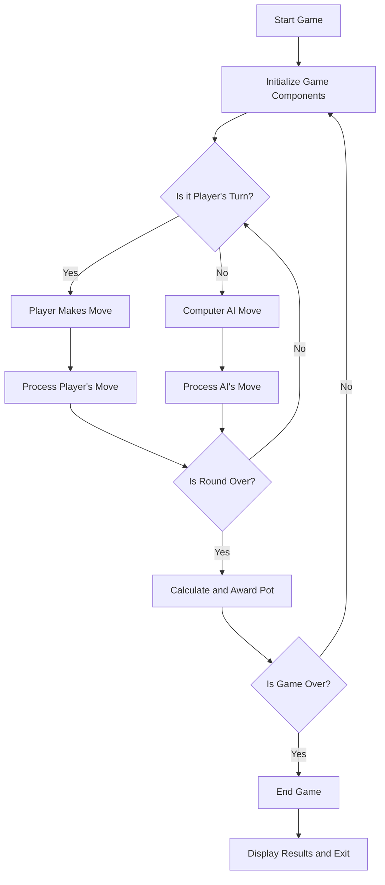

# Zach Robinson's personal maven project

```mermaid

flowchart TB
    A[Start Game] --> B[Initialize Game Components]
    B --> C{Is it Player's Turn?}
    C -->|Yes| D[Player Makes Move]
    C -->|No| E[Computer AI Move]
    D --> F[Process Player's Move]
    E --> G[Process AI's Move]
    F --> H{Is Round Over?}
    G --> H
    H -->|Yes| I[Calculate and Award Pot]
    H -->|No| C
    I --> J{Is Game Over?}
    J -->|Yes| K[End Game]
    J -->|No| B
    K --> L[Display Results and Exit]

```
