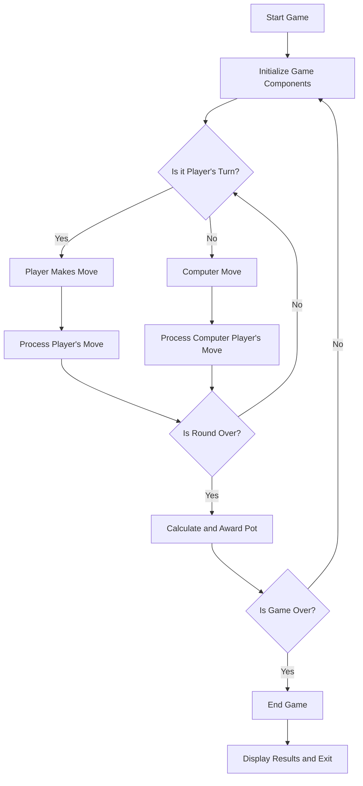

# Five-Card Draw Command Line Poker

This project is a one-player poker simulator, played from the terminal of an IDE. The player using the number pad on their keyboard to place bets and decide which card, if any, they wish to discard and redraw.
It features two computer players that make decisions based on the two highest cards in their hands, the current phase of gameplay, and the betting behaviors of the other players. 

### What I Learned

### Properties of the Code

### Technology Stack

### Strengths

### Challenges

### What I'm proud of

### What I would like to add

### How to run
