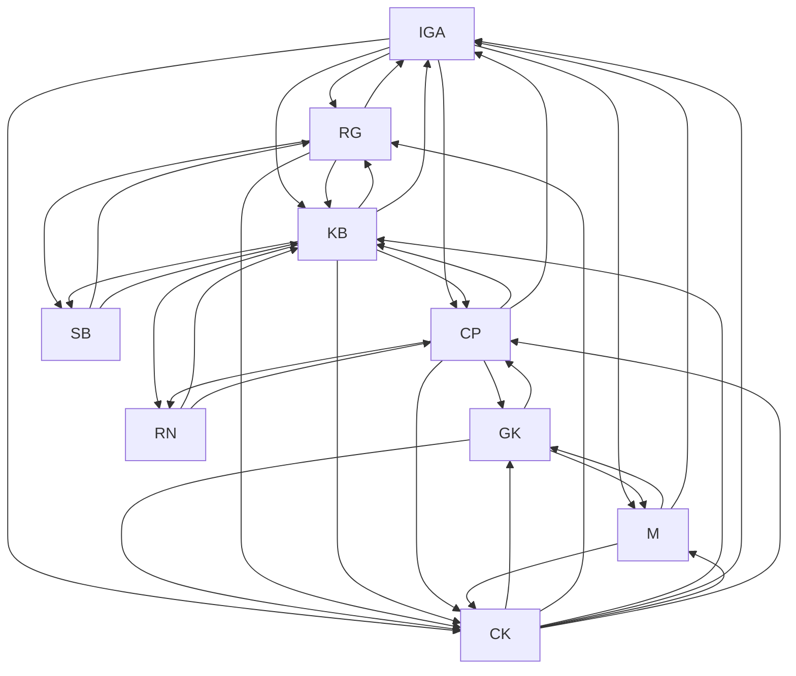

# Graph Algorithms

## Prim's Minimum Spanning Tree

```mermaid
graph TD
    IGA-->RG
    IGA-->KB
    IGA-->CP
    IGA-->M
    IGA-->CK
    GK-->M
    GK-->CP
    GK-->CK
    RG-->KB
    RG-->IGA
    RG-->SB
    RG-->CK
    KB-->RG
    KB-->IGA
    KB-->CP
    KB-->RN
    KB-->SB
    KB-->CK
    CK-->GK
    CK-->RG
    CK-->KB
    CK-->IGA
    CK-->M
    CK-->CP
    RN-->KB
    RN-->CP
    CP-->GK
    CP-->KB
    CP-->IGA
    CP-->RN
    CP-->CK
    M-->GK
    M-->IGA
    M-->CK
    SB-->RG
    SB-->KB
```
