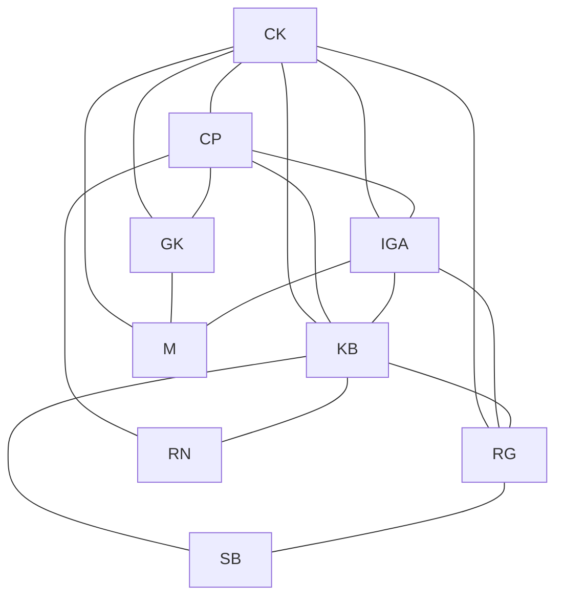

# Graph Algorithms

## Prim's Minimum Spanning Tree

```mermaid
graph TD
    CK---CP
    CK---GK
    CK---IGA
    CK---KB
    CK---M
    CK---RG
    CP---GK
    CP---IGA
    CP---KB
    CP---RN
    GK---M
    IGA---KB
    IGA---M
    IGA---RG
    KB---RG
    KB---RN
    KB---SB
    RG---SB
```

## Dijkstra's Shortest Path
