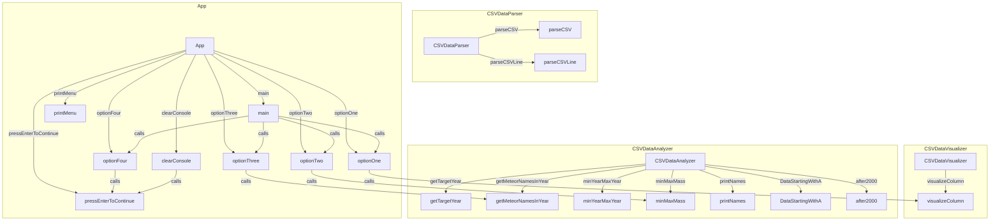

```mermaid
graph TD

subgraph CSVDataParser
  A[CSVDataParser] -->|parseCSV| B[parseCSV]
  A -->|parseCSVLine| C[parseCSVLine]
end

subgraph CSVDataVisualizer
  D[CSVDataVisualizer] -->|visualizeColumn| E[visualizeColumn]
end

subgraph CSVDataAnalyzer
  F[CSVDataAnalyzer] -->|getTargetYear| G[getTargetYear]
  F -->|getMeteorNamesInYear| H[getMeteorNamesInYear]
  F -->|minYearMaxYear| I[minYearMaxYear]
  F -->|minMaxMass| J[minMaxMass]
  F -->|printNames| K[printNames]
  F -->|DataStartingWithA| L[DataStartingWithA]
  F -->|after2000| M[after2000]
end

subgraph App
  N[App] -->|main| O[main]
  N -->|printMenu| P[printMenu]
  N -->|optionOne| Q[optionOne]
  N -->|optionTwo| R[optionTwo]
  N -->|optionThree| S[optionThree]
  N -->|optionFour| T[optionFour]
  N -->|clearConsole| U[clearConsole]
  N -->|pressEnterToContinue| V[pressEnterToContinue]
end

O -->|calls| Q
O -->|calls| R
O -->|calls| S
O -->|calls| T

Q -->|calls| E
R -->|calls| J
S -->|calls| H
T -->|calls| V

U -->|calls| V
```