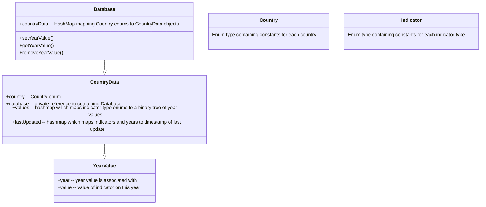

# Junipers personal Maven project

```mermaid
classDiagram
    Database --|> CountryData
    CountryData --|> YearValue
    class Database {
        +countryData -- HashMap mapping Country enums to CountryData objects
        +setYearValue()
        +getYearValue()
        +removeYearValue()
    }
    class CountryData {
        +country -- Country enum
        +database -- private reference to containing Database
        +values -- hashmap which maps indicator type enums to a binary tree of year values
        +lastUpdated -- hashmap which maps indicators and years to timestamp of last update
    }
    class YearValue {
        +year -- year value is associated with
        +value -- value of indicator on this year
    }
    class Country {
        Enum type containing constants for each country
    }
    class Indicator {
        Enum type containing constants for each indicator type
    }
```
