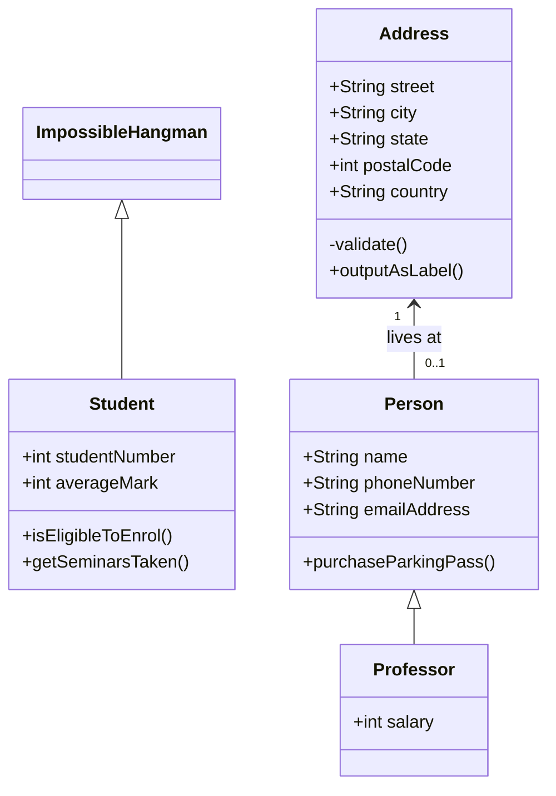

<!-- Improved compatibility of back to top link: See: https://github.com/othneildrew/Best-README-Template/pull/73 -->

<!--
*** Thanks for checking out the Best-README-Template. If you have a suggestion
*** that would make this better, please fork the repo and create a pull request
*** or simply open an issue with the tag "enhancement".
*** Don't forget to give the project a star!
*** Thanks again! Now go create something AMAZING! :D
-->

<!-- PROJECT SHIELDS -->

<!--
*** I'm using markdown "reference style" links for readability.
*** Reference links are enclosed in brackets [ ] instead of parentheses ( ).
*** See the bottom of this document for the declaration of the reference variables
*** for contributors-url, forks-url, etc. This is an optional, concise syntax you may use.
*** https://www.markdownguide.org/basic-syntax/#reference-style-links
-->

[![Contributors][contributors-shield]][contributors-url]

<!-- PROJECT LOGO -->

<br />
<div align="center">
  <a href="https://github.com/TheEvergreenStateCollege/upper-division-cs/tree/main/dsa-23au/ndeanon25/src/main/java/com/ndeanon25/FinalProjectDSA">
    
  </a>

<h3 align="center">Impossible Hangman</h3>

<p align="center">
    This is Hangman with a twist. It appears to be a simple hangman game but the twist! It is a program where it does not choose a word but rather a list of words/patterns that match your input. Players will have to rely on their deduction skills to guess the word correctly.   
    <br />
    <a href="https://github.com/TheEvergreenStateCollege/upper-division-cs/tree/main/dsa-23au/ndeanon25/src/main/java/com/ndeanon25/FinalProjectDSA"><strong>Explore the docs »</strong></a>
    <br />
    <br />
    <a href="https://asciinema.org/a/cN3aa7p0QKWrrFNpfpLfUgqs3">View Demo</a>
  </p>
</div>

<!-- TABLE OF CONTENTS -->

<details>
  <summary>Table of Contents</summary>
  <ol>
    <li>
      <a href="#about-the-project">About The Project</a>
      <ul>
        <li><a href="#built-with">Built With</a></li>
      </ul>
    </li>
    <li>
      <a href="#inspiration">Inspiration</a>
      <ul>
        <li><a href="#inspiration">What Inspired Me</a></li>
        <li><a href="#getting-started-and-running-the-game">Getting Started and Running the Game</a></li>
      </ul>
    </li>
    <li><a href="#how-i-did-i-make-it-run">How I did I Make it Run</a></li>
    <li><a href="#roadmap">Roadmap</a></li>
    <li><a href="#contributing">Contributing</a></li>
    <li><a href="#license">License</a></li>
    <li><a href="#contact">Contact</a></li>
    <li><a href="#acknowledgments">Acknowledgments</a></li>
  </ol>
</details>

<!-- ABOUT THE PROJECT -->

## About The Project


<li> This project has been satifying but frustrating at the same time. 
 <li> Github User : ndeanon25
 <li> Repo : Upper-Division-CS


### Built With

* [![Java]][Java-url]
* [![VSCode]][VSCode-url]
* Pain / Headaches / No Sleep


<!-- Inspiration  -->

## Inspiration

My inspiration has always been my love for video games. I did not want to over reach and try to create some 3-D video game, I wanted to do a simple puzzle. In my last CS class, we worked on a simple hangman game and I enjoyed it so much that I wanted to make a more complex hangman game. This led me to making a hangman game that basically cheats to make it impossible to win.

### Software Design Diagram

This is my UML

### Getting Started and Running the Game

1. Go to this Directory
   ```sh
   /workspace/upper-division-cs/dsa-23au/java-dsa/ndeanon25/src/main/java/com/ndeanon25/FinalProjectDSA
   ```
2. Run the file ImpossibleHangman.java with Java Red Hat Extension
   ```sh
   Download = Name: Language Support for Java(TM) by Red Hat
   ```
3. ENJOY THE GAME!!


<!-- How I did I Make it Run -->

## How I did I Make it Run?

Magic. Really, this was a struggle. I made a gameplan and some diagrams of what I wanted.

<li> Read from my dictionary file
<li> Get the input from the player
<li> Use my methods from HangmanLogic ( Behind the scenes)
<li> Start the Hangman game
<li> Lose


<!-- Challenges I ran into-->

## Challenges I ran into

I changed my data structures like 7 times and most of the time I had a surface level understanding of what is I am implementing. StackOverFlow then finally led me to a TreeSet. It is a balanced tree, that uses Set. ChatGPT helped me implement it and figure out what I wanted to do. 

The hardest method for me was the record method. This method will record the user's guess and return a String representation of the word with the guessed char. Based on the guessed char, it will choose the next wordlist and then keep doing that every guess.  

<!-- What I learned-->

## The Learning Experience 

This is used for the
<!-- LICENSE -->

## License

Distributed under the MIT License. See `LICENSE.txt` for more information.


<!-- CONTACT -->

## Contact

Your Name - [@twitter_handle](https://twitter.com/twitter_handle) - email@email_client.com

Project Link: [https://github.com/github_username/repo_name](https://github.com/github_username/repo_name)


<!-- ACKNOWLEDGMENTS -->

## Acknowledgments

* [Thank you, othneildrew for the Github README Template](https://github.com/othneildrew/Best-README-Template/blob/master/BLANK_README.md?plain=1)
* []()
* []()


<!-- MARKDOWN LINKS & IMAGES -->

<!-- https://www.markdownguide.org/basic-syntax/#reference-style-links -->

[contributors-shield]: https://img.shields.io/badge/github-%23121011.svg?style=for-the-badge&logo=github&logoColor=white
[contributors-url]: https://github.com/ndeanon25
[Java]: https://img.shields.io/badge/java-%23ED8B00.svg?style=for-the-badge&logo=openjdk&logoColor=white
[Java-url]: https://www.java.com/en/
[VSCode]: https://img.shields.io/badge/Visual%20Studio%20Code-0078d7.svg?style=for-the-badge&logo=visual-studio-code&logoColor=white
[VSCode-url]: https://code.visualstudio.com/
