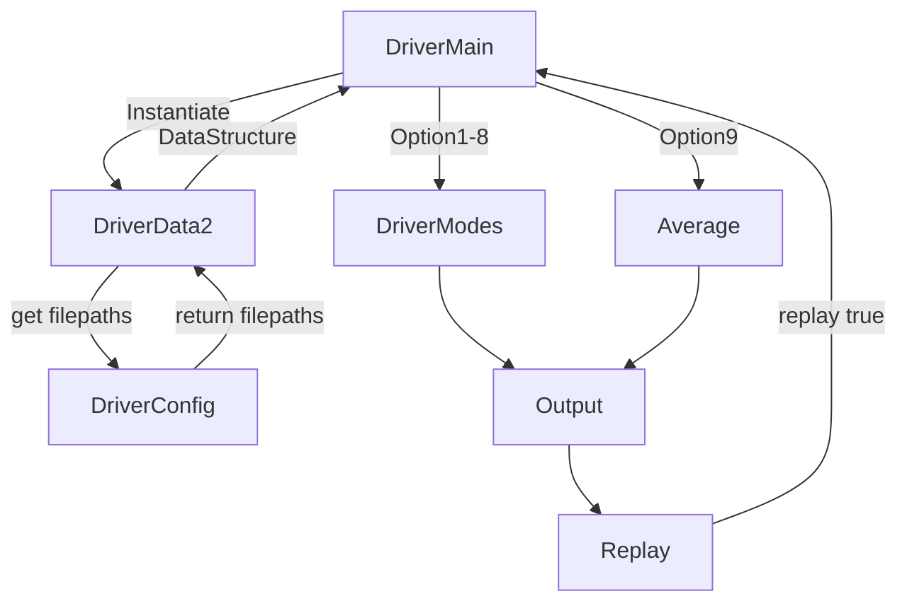

## Overview
This program reads two csv files of driver specific information curated manually and assigns them into memory with single data structure of a dictionary of dictionaries or map of hashmaps.
Then, several modes are offered to the user to choose the next operations 1-9 with 10 being an exit.

## Inspiration
I was faced with a challenging decision upon going back the school where I barely moved into my new house and school was 86 miles away. Would it be better to drive to and from class daily or to stay locally at a park with spares amenities and no internet. I decided to write a program to use data to help inform or reinforce my decision.

## Software Design Diagram

```mermaid
flowchart LR
    id1[[Step-by-step description]]
````
To start the program you call DriverMain.py or the BackupLogic.py (for python != 3.10)

* Step 1: DriverMain calls DriverData to instantiate.
* Step 2: DriverData calls DriverConfig for filenames filepath1 and filepath2 (the csv files).
* Step 3: DriverConfig checks for each filepath hardcoded and if none is found, searches for the last edited version with regex. Cls.filepath1 and cls.filepth2 are then provided for DriverData to continue.
* Step 4: DriverData opens the first csv file, reads each line into a list, generates driver_keys, then adds the driver_keys as key and the corresponding line to a builder dictionary. Then the DataStructure is updated.
* Step 5: DriverData opens the second csv file and repeats step 4. The DataStructure is now complete.
* Step 6: The DriverMain outputs the list for the user to choose the next operations.
* Step 7: When a choice is made, DriverMain calls the DriveMode function alone, runs the operation and outputs to the console.
* Step 8: After the operation completes, the ser is ask to continue or type exit.
* Step 9: If replay is true, repeat from Step6.
* Step 10: If exit is typed or 10 replays are reached or the user types 10, the program exits.
## How to run our demo on our included data
To run the stand-alone, command-line application do the following.
    
1. Make sure you are on the main branch version or on my pipeline for the latest version
        
2. Check your ability to switch cleanly:
    
    a. run  `git status`, if you have uncommitted changes, you may want to `git stash` them (restore with `git stash pop 0`)

3. Switch to a branch with a working copy
    `git switch main`,  or   `git switch pswish-nathnmcl`

4. run `/usr/local/bin/python3.10 ~/workspace/Evergreen/upper-division-cs/dsa-23au/java-dsa/pswish-natmcl/pswish-app/python/Version1_3/DriverFiles/DriverMain.py`. If you get a file not found, drill down into the directory in the file path and run it with `python3.10 DriverMain.py`

if you get a syntax error at match, you may not have python 3.10 installed. You can still run my program with >>> `python3 BackupLogic.py`

### From Gitpod:
> run >>> `python /workspace/upper-division-cs/dsa-23au/java-dsa/pswish-natmcl/pswish-app/python/Version1_3/DriverFiles/DriverMain.py`

or
>run >>> `python /workspace/upper-division-cs/dsa-23au/java-dsa/pswish-natmcl/pswish-app/python/Version1_3/DriverFiles/BackupLogic.py`

## How to run our tests and what they mean
Our tests are for Pytest only. 
Right now, tests passing mean that the data structure logic is functional. 

Install `pytest` if you can. 

Then navigate to the root directory or DriverFiles and simply run >> `pytest`

## Challenges we ran into
I frequently change between GITPOD, EC2 and my mac so having the right csv link has been a consistent problem. I hopefully solved that with the latest config logic. 
NoneType problems were challenging when writing tests.
Figuring out how to search for a value in a nested dictionary was tricky

## Accomplishments that we're proud of
Proud of adding new complexity to my python programming tool set. Before this program, I was more of a one page python programmer. I am also proud of writing tests that work and finally understanding mocking.
I'm proud of how the program performs and the results so far, plus the ease to add calculations.

## What we learned
Switching languages is HARD when you have a potential brute-force solution already in your head.
I learned what a complex data structure looked like in python. I also learned that sometimes it is better to go with what you know instead of doing too much at once.

## What's next for the project next quarter (as an app engineered for the web)
Next, I would like to add a few more methods to calculate other predictions. Also, I want to shift to a django project for more persistent results. I would like to add in weather and possibly traffic info to see if there is a relationship to drive times over 10 miles vs 20 vs 80+ and how much cost does bad weather add to a drive? Maybe add threading for reading csv data if the dataset is gigantic.
