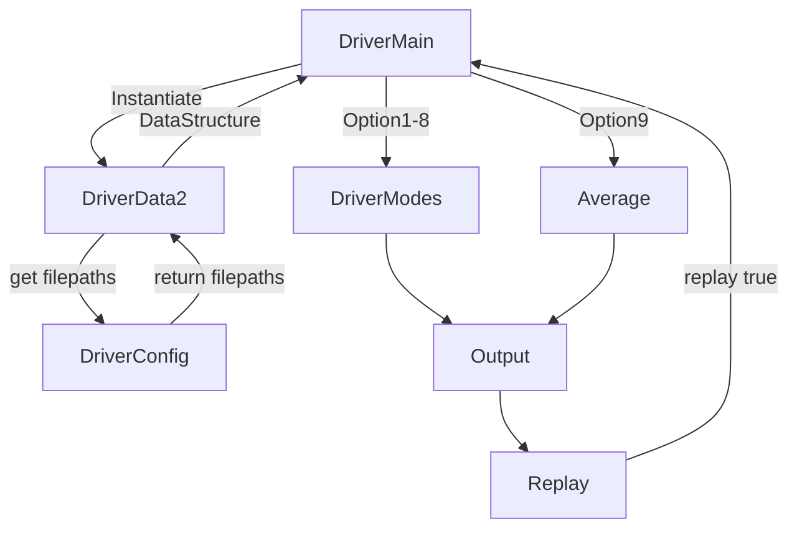

## Overview
This program reads two csv files of driver specific information curated manually and assigns them into memory with single data structure of a dictionary of dictionaries or map of hashmaps.
Then, several modes are offered to the user to choose the next operations 1-9 with 10 being an exit.

## Inspiration
I was faced with a challenging decision upon going back the school where I barely moved into my new house and school was 86 miles away. Would it be better to drive to and from class daily or to stay locally at a park with spares amenities and no internet. I decided to write a program to use data to help inform or reinforce my decision.

## Software Design Diagram



To start the program you call DriverMain.py or the BackupLogic.py (for python != 3.10)

* Step 1: DriverMain calls DriverData to instantiate.
* Step 2: DriverData calls DriverConfig for filenames filepath1 and filepath2 (the csv files).
* Step 3: DriverConfig checks for each filepath hardcoded and if none is found, searches for the last edited version with regex. Cls.filepath1 and cls.filepth2 are then provided for DriverData to continue.
* Step 4: DriverData opens the first csv file, reads each line into a list, generates driver_keys, then adds the driver_keys as key and the corresponding line to a builder dictionary. Then the DataStructure is updated.
* Step 5: DriverData opens the second csv file and repeats step 4. The DataStructure is now complete.
* Step 6: The DriverMain outputs the list for the user to choose the next operations.
* Step 7: When a choice is made, DriverMain calls the DriveMode function alone, runs the operation and outputs to the console.
* Step 8: After the operation completes, the ser is ask to continue or type exit.
* Step 9: If replay is true, repeat from Step6.
* Step 10: If exit is typed or 10 replays are reached or the user types 10, the program exits.
## How to run our demo on our included data

### From Gitpod:
Tip! Sometimes you cannot copy from readme preview so watch your copy/paste!

> run >>> `python /workspace/upper-division-cs/dsa-23au/java-dsa/pswish-natmcl/pswish-app/python/Version1_3/DriverFiles/DriverMain.py`

>or

>run >>> `python /workspace/upper-division-cs/dsa-23au/python-dsa/DriverMain.py`

>or 

>run >>> `python /workspace/upper-division-cs/dsa-23au/java-dsa/pswish-natmcl/pswish-app/python/Version1_3/DriverFiles/BackupLogic.py`

Link to a live demo: https://asciinema.org/a/J5m0wUhuOukmelq7S9u3xflig
[](https://asciinema.org/a/J5m0wUhuOukmelq7S9u3xflig)

### Quick Troubleshooting:
To run the stand-alone, command-line application do the following.
    
1. Make sure you are on the main branch version or on my pipeline for the latest version
        
2. Check your ability to switch cleanly:
    
    a. run  `git status`, if you have uncommitted changes, you may want to `git stash` them (restore with `git stash pop 0`)

3. Switch to a branch with a working copy
    `git switch main`,  or   `git switch pswish-nathnmcl`

4. run `/usr/local/bin/python3.10 ~/workspace/Evergreen/upper-division-cs/dsa-23au/java-dsa/pswish-natmcl/pswish-app/python/Version1_3/DriverFiles/DriverMain.py`. If you get a file not found, drill down into the directory in the file path and run it with `python3.10 DriverMain.py`

if you get a syntax error at match, you may not have python 3.10 installed. You can still run my program with >>> `python3 BackupLogic.py`

## How to run our tests and what they mean
Our tests are for Pytest only. 
Right now, tests passing mean that the data structure logic is functional. 

Install `pytest` if you can >>> `pip3 install pytest`
then update your path: `export PATH="$HOME/.local/bin:$PATH"`

Then navigate to the root directory or DriverFiles and simply run >> `pytest`

## Challenges we ran into
I frequently change between GITPOD, EC2 and my mac so having the right csv link has been a consistent problem. I hopefully solved that with the latest config logic. 
NoneType problems were challenging when writing tests.
Figuring out how to search for a value in a nested dictionary was tricky

## Accomplishments that we're proud of
Proud of adding new complexity to my python programming tool set. Before this program, I was more of a one page python programmer. I am also proud of writing tests that work and finally understanding mocking.
I'm proud of how the program performs and the results so far, plus the ease to add calculations.

## What we learned
Switching languages is HARD when you have a potential brute-force solution already in your head.
I learned what a complex data structure looked like in python. I also learned that sometimes it is better to go with what you know instead of doing too much at once.

## What's next for the project next quarter (as an app engineered for the web)
Next, I would like to add a few more methods to calculate other predictions. Also, I want to shift to a django project for more persistent results. I would like to add in weather and possibly traffic info to see if there is a relationship to drive times over 10 miles vs 20 vs 80+ and how much cost does bad weather add to a drive? Maybe add threading for reading csv data if the dataset is gigantic.

## The Main Invariant
An important invariant in our program is the cls.DataStructure. Once it is created in DriverFiles.DriverData2._add_list_to_dict_by_index(). At the conclusion of n csv files, the function ends with the final invariant. It is then passed around the program without changing. This is important because several algorithms and calculations depending on counting totals of items in the data structure. If they were to change mid-flight, the calculations would be inconsistent and thus useless.

## Space Complexity (preliminary)
Preliminary testing using guppy3 returned this info:
```
Partition of a set of 50564 objects. Total size = 7143962 bytes.
 Index  Count   %     Size   % Cumulative  % Referrers by Kind (class / dict of class)
     0   3649   7  1189372  17   1189372  17 function
     1  13768  27  1165236  16   2354608  33 types.CodeType
     2   5594  11   626983   9   2981591  42 dict of type
     3   5890  12   451635   6   3433226  48 tuple
     4     15   0   394777   6   3828003  54 _io.TextIOWrapper
     5   2388   5   386461   5   4214464  59 type
     6   1783   4   338523   5   4552987  64 dict of module
     7    916   2   245033   3   4798020  67 function, tuple
     8   3954   8   236177   3   5034197  70 dict (no owner)
     9    239   0   222503   3   5256700  74 dict of module, tuple
     <662 more rows. Type e.g. '_.more' to view.>
```

Gitpod reserved 1g to run this program(as obsvered with `top`)