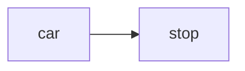
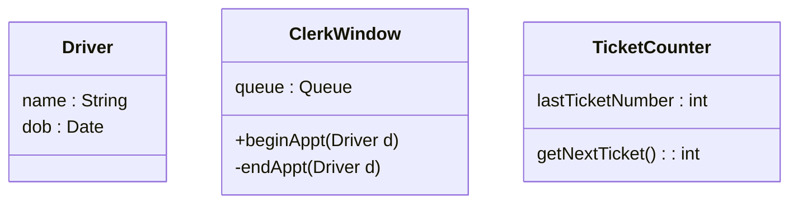

# DMV Diagram for @learner-long-life

Practice diagrams in Mermaid in GitHub Markdown.

```mermaid
flowchart LR
   car --> stop
```

```mermaid
classDiagram
    class Driver {
        name : String
        dob : Date
    }
    class ClerkWindow {
        queue : Queue
        +beginAppt(Driver d)
        -endAppt(Driver d)
    }
    class TicketCounter {
        lastTicketNumber : int
        getNextTicket() : int
    }
```
