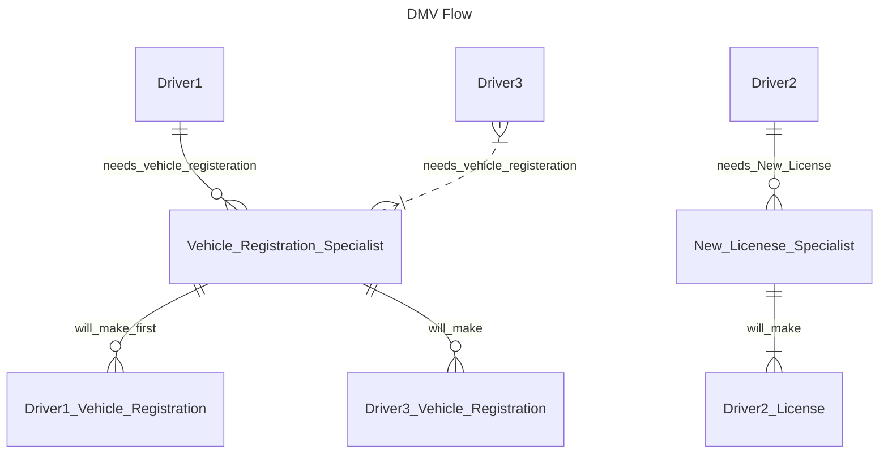
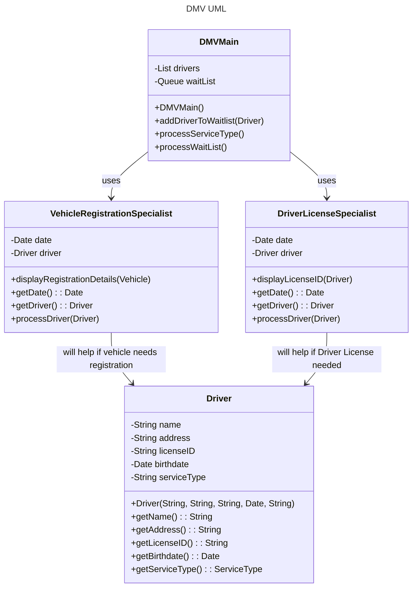

This is the Homework Problem on Assignment 5
======

```mermaid
---
title: DMV Flow
 
---
erDiagram
    Driver1 ||--o{ Vehicle_Registration_Specialist : needs_vehicle_registeration
    Driver2 ||--o{ New_Licenese_Specialist : needs_New_License
    Vehicle_Registration_Specialist ||--o{ Driver1_Vehicle_Registration : will_make_first
    New_Licenese_Specialist ||--|{ Driver2_License : will_make
    Driver3 }|..|{ Vehicle_Registration_Specialist : needs_vehicle_registeration
    Vehicle_Registration_Specialist ||--o{ Driver3_Vehicle_Registration : will_make
```

*Note - DMV has only walk-ins, no appointments 

```mermaid
---
title: DMV UML
 
---
classDiagram
    class Vehicle Registration Specialist {
        -Date date
        -Driver driver
        +displayRegistrationDetails(Vehicle)
        +getDate(): Date
        +getDriver(): Driver
        +processDriver(Driver)
    }
    class Driver License Specialist {
        -Date date
        -Driver driver
        +displayLicenseID(Driver)
        +getDate(): Date
        +getDriver(): Driver
        +processDriver(Driver)
    }
    class DMVMain {
        -List<Driver> drivers
        -Queue<Driver> waitList
        +DMVMain()
        +addDriverToWaitlist(Driver)
        +processServiceType()
        +processWaitList()
    }
    class Driver {
        -String name
        -String address
        -String licenseID
        -Date birthdate
        -String serviceType
        +Driver(String, String, String, Date, String)
        +getName(): String
        +getAddress(): String
        +getLicenseID(): String
        +getBirthdate(): Date
        +getServiceType(): ServiceType
        

    }
    Vehicle Registration Specialist --> Driver : will help if vehicle needs registration
    DMVMain --> Vehicle Registration Specialist: uses
    DMVMain --> Driver License Specialist : uses
    Driver License Specialist --> Driver : will help if Driver License needed 
```
