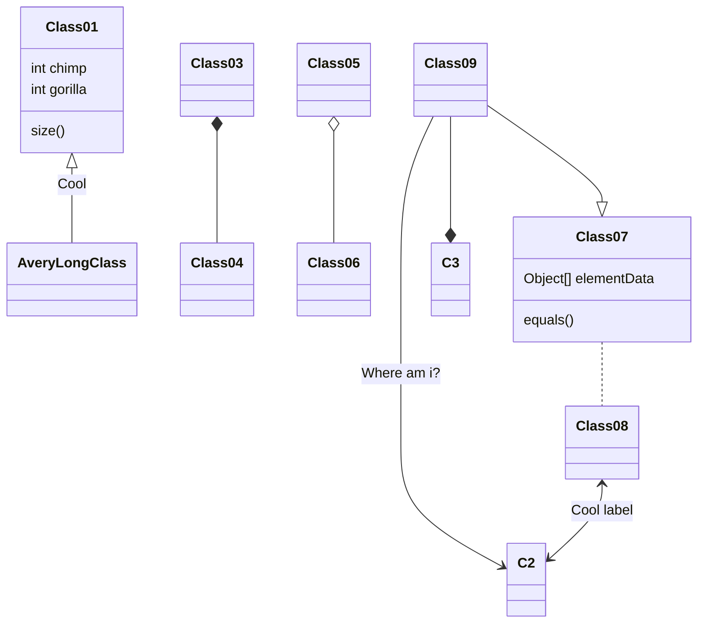
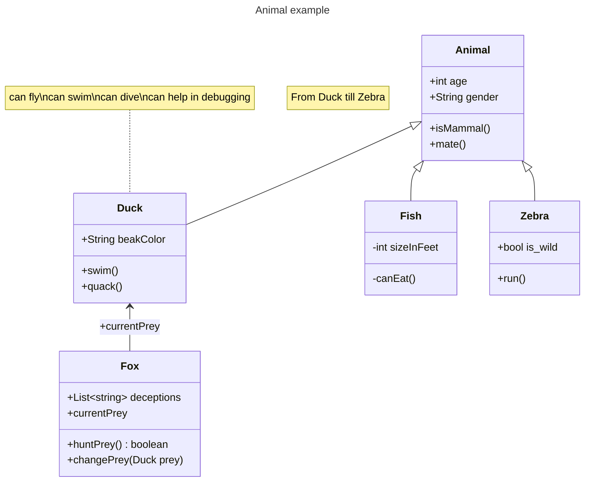

# Week 05
23 October 2023

## Morning

## Warmup

* [Learn Java on Codecademy](https://www.codecademy.com/enrolled/courses/learn-java)

* Learn Git and GitHub with [Visualizing Git Branches](https://learngitbranching.js.org/?locale=en_US)

## Co-Creation Sentences

[Excellent example of co-creation statements](https://github.com/TheEvergreenStateCollege/upper-division-cs/pull/153/files)

* State what you believe is true about computer science, that you think will pull others forward
* Give an update on your project thinking and design, allows others to help you or suggest resources

Other examples:

* A good place to ask questions about computer science or programming to advance  your skills further
* A good place to check your understanding by trying out a statement about computer science or programming.
* Repeating back statements you think are important from the book, class, or online resources.
* Make opinionated statements about computer science or programming ("My favorite <blah> is <blah> because of <blah>")
  that you think will help other students learn more effectively, save them time, help them do more, or give them a way of thinking that you find helpful.

## Six Kinds of Java Statements (for Analyzing Runtime)

In Java, each line, ending in a semi-colon is called a statement.
While it may appear that there are infinitely many different kinds of
lines to understand, there are only a 6 kinds to understand, with respect
to analyzing running times and the Big-Oh behavior of an algorithm.

a. [1 step] Assignment from a literal or reference value:  `Type var = value;`
  * `value` can be a literal like the number `5` or the String `"hello"`
  * `value` can also be a reference, like `a`, in which case you would look for `a`
    in the surrounding scope. This statement expects `var` and `a` to have
    compatible types
  * when counting running time, assignments count as `1` step.

b. [variable steps] Assignment from a function call: `Type var = func(arg1, arg2, ...);`
  * `arg1`, `arg2` etc. can be either values or references as in the previous statement type.
  * when counting running time, you need to count the running time of `func` recursively,
  * then add one step (for assignment)
  * enters a new function (pushes down a function call on a stack)

c. [0 steps] Declaration statements, that declare a variable and its type, or declare a class, or an interface
   i.  `SomeType somevar;` declares a variable, which is initally null.
   ii. `public class SomeClass` declares a (public) class, one that's visible outside its package
   iii. `public interface SomeInterface` declares a (public) interface
 
d. [variable steps] Loop statements open a new code block / scope
   i. `while (<condition>)`
   ii. `for (<setup>; <condition>; <update>) {}`

e. [1 step] if-else statements, open a new code block and scope
   i. `if (<condition>) {}`
   ii. `else if (<condition>) {}`
   iii. `else {}`
   iv. `try/catch` statements roughly fall in this category too, they set up a "distributed if-else" to react to error conditions

f. [1 step] `return` statements, end a function call and return to its caller, optionally with a value
   i. `return`
   ii. `throw`

### Question:

Use the above classification to count any code that you've written.
You can start looking in the `dsa-23au/java-dsa` projects.

## Implementations and Interfaces (ADTs)

### Example 1

Remember that an *interface* is a set of methods (with names,
return types, and arguments of a particular type, number, and order).
It is a behavioral promise. In our code, when we need the behavior of,
say, a *List* interface, we can substitute anything that implements List.

This is an abbreviated list of the methods in the Java `List<T>` interface
(which takes a generic type `T`).

```
public interface List<T> {

    // add a new item to the end of the list
    public boolean add(T newItem);

    // search for a given target item
    public boolean contains(T targetItem);

    // remove an item at an index
    public T remove(int index);
}
```

Note how all of these methods are just *declarations* and end in
a semi-colon `;` without a method body between curly braces
`{` and `}`. That is, it is missing *implementations*.

Here is an example of our `LinkedListWrapper` which *implements*
the `List` interface. Again, we abbreviate just to show it's
method for the above methods. For each of these methods,
analyze its Big-Oh running time, by counting steps line-by-line.

```
public class LinkedListWrapper<T> {

    private Node head;
    private Node tail;
    private int size;

    public boolean add(T newItem) {
        if (size > maxSize) {
            return false;
        }
        Node<T> newNode = new Node<>(newItem);
        if (head == null) {
           head = newNode;
        }
        if (tail == null) {
            tail = newNode;
        } else {
            tail.next = newNode;
            tail = newNode;
        }
        return true;
    }

    public boolean contains(T target) {
        Node curr = head;
        while (curr != null) {
            if (curr.data.equals(target)) {
                return;
            };
            curr = curr.next;
            i -= 1;
        }
    }

    public T remove(int i) {
        if (i < 0 || i >= size) {
            return false;
        }
        Node curr = head;
        Node prev = head;
        while (i > 0 && curr != null) {
            prev = curr;
            curr = curr.next;
            i -= 1;
        }
        if (curr != null) {
            prev.next = curr.next;
        }
    }
}
```

Interfaces are sometimes called "Abstract Data Types" or (ADTs) in
the textbook, because they don't specify specific implementation (they are
abstract). In our food and kitchen analogy, the interface is the menu.


In our depth-first search, we needed something with a *List interface* that
we could add nodes to, in the order that we visited them. (The "visited" list).

We proposed various solutions for implementations.

### Using Stacks to Implement a List Interface

```
import java.util.Stack;

public class StackList<T> implements List<T> {

    private Stack<T> first; // our main container for data
    private Stack<T> flop; // we temporarily pop items here while search first, then empty it again back to first
    private int maxSize;

    public StackList(int maxSize) {
        first = new Stack<>();
        flop = new Stack<>();
        this.maxSize = maxSize;
    }

    public boolean add(T newItem) {
        first.push(newItem);
    }

    public boolean contains(T target) {
        boolean found = false;
        while (!first.isEmpty()) {
            T temp = first.pop();
            found = found || (temp.equals(target));
            flop.push(temp);
        }
        while (!flop.isEmpty()) {
            T temp = flop.pop();
            first.push(temp);
        }
    }

    public T remove(int i) {
        if (i < 0 || i >= size) {
            return null;
        }
        while (!first.isEmpty()) {
            
        }
    }
        
}
```

#### *Question:* Write QueueList that usees Queues to implement List

Following the example above with Stack, implement a class called QueueList<T>.

## Structure of the Monorepo

This monorepo organizes code in a directory structure, which is the same
whether you are:

1. editing it on the github.com website,
2. editing it inside your IDE like VS Code or IntelliJ
3. on the command-line.

You will see the same directories and files in all three methods.

In fact, it is a tree data structure that we've been learning in class.


```
* <project-root>
  * dsa-23au
    * java-dsa
```


## Tree Review


## Your Final Project

This week you'll begin diagramming and writing code for your final project.
First you'll create a Maven project in the directory `java-dsa`.

### Choose a Company Domain and Main Class Name

To create a Java project and develop it for this class, you'll need to choose three names.
These are mostly business or aesthetic choices to your taste, and don't affect the technical
capabilities of your program. However, following UNIX naming conventions is helpful.

They should contain only letters and numbers, with a hyphen `-` as an optional word separator.

Your company domain name would be something that could be resolved to a website. It doesn't
have to currently exist, but you can think of it as what your future website name would be.
It will contain a hostname part and a top-level domain (TLD) part.

For example, in our fictional organization for this class:

```
codewithfriends.dev
```

The hostname is `codewithfriends` and the TLD is `.dev`, usually for websites devoted to programming,
programmers (developers), and the computational arts.

The Java package name is simply the reverse of the company domain name.[1](#footnote-1)

```
dev.codewithfriends
```

That's why this line appears at the top of all the Java files for the class projects.

```
package dev.codewithfriends;
```

Not all package names corre

All classes in this package can refer to each other without fully-qualifying.

In GitPod, the `<project-root>` directory above is located at `/workspace/upper-division-cs`.

On your own computer, it depends on where you cloned the repository.
Ask your pair programming partner, your TA, or the instructor for help if you need help finding your directory.

Once you're in the `<project-root>` 

```
cd dsa-23au/java-dsa
<insert maven invocation here>
```

You can find more details and links here [].


## Java Class and Interface Syntax 

Java is a mostly object-oriented imperative language,
everything is based on classes (a template for producing objects) and interfaces
(a template for promising behaviors and interoperate methods),
hence the name *class diagram*.


## Class Diagram (UML)

Class diagrams are used to represent the relationships between the main
entities in your program.
In this class, we recommend using the [Mermaid diagramming language]() which is built-into GitHub
markdown for convenient editing. When diagram is kept separate from code, it can

* fall behind or become out-of-date
* take extra time and cognitive overhead to switch programs
* not get done at all

However, it cannot generate all possible diagrams, or mockups. If you already have a tool
that you like and are used to, feel free to continue using it. Please save or take screenshots
of your drawings and save them as PNG or SVG into this monorepo.

* Figma
* Draw.io

### Install the VSCode Plugin for Mermaid Previews

Inside GitPod, click on the "Extensions" sidebar.
Search for "Mermaid Preview" and install this plugin shown in the screenshot.


The following is a class diagram of the `BinarySearchTree` class and the depth-first-search
that we wrote last week.





Let's build up this example line-by-line. To do this, 

Let's say we've identified that a fundamental building block in our program needs to be an `Animal`
class. We can begin 

```
classDiagram
    note "From Duck till Zebra"
    Animal <|-- Duck
    note for Duck "can fly\ncan swim\ncan dive\ncan help in debugging"
    Animal <|-- Fish
    Animal <|-- Zebra
    Animal : +int age
    Animal : +String gender
    Animal: +isMammal()
    Animal: +mate()

```


More details about the syntax and advanced features you can use are at
[the excellent MermaidJS documentation](https://mermaid.js.org/syntax/classDiagram.html).

# Footnotes

## Footnote 1
You can tell that the Java developers were really caught up in the fervor of the Internet tech bubble
of the 90s. They really saw programming in the future as inextricably connected with
the Internet and connectivity.
