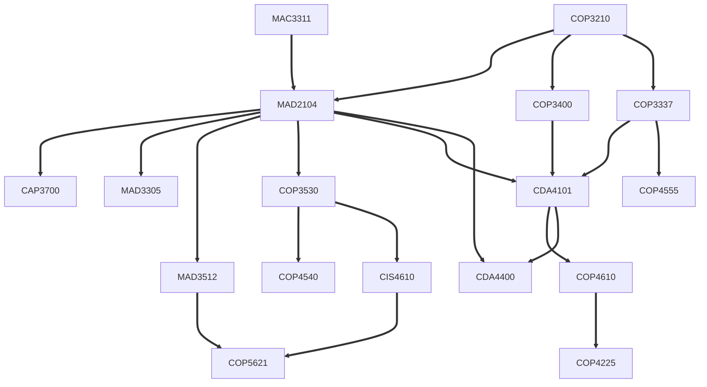

# Week 9 - Day 
27 Nov 2023 - Monday

# Morning Session

## Planned Schedule

### Week 9 (this week)

Graphs, data structure and algorithms.
Code reviews for homeworks and hackerrank problems of weeks 1-8.

* Monday - topological sort
* Tuesday - pagerank, adjacency matrix
* Thursday - shortest path (Dijkstra's)

Homework 9: graph problems, readings on open source licenses, make a README.md file and unit tests for your project
Advent of Code (starting Dec 1st): no AI is allowed at all to come up with your original solution, but to submit it. Day 1 substitutes for 10 points, 

### Week 10 (next week)

Final Project Presentations
* Monday - work on final projects in class, using asciinema and screen recordings
* Tuesday - practice presentations
* Thursday - final presentations

## Code Buildup Game (How to Submit Code Problems in the Future, and AI Collaboration Policy)

In the code review appointments this week, I will ask you to prepare
by performing the following activity (the Code Imitation Game).

The game and the appointments have two purposes.

The first purpose is for you to demonstrate that you understand
the code you've submitted, that you typed it in character-by-character (not copy and paste),
and that you understand the overall structure of the code by typing in high-level lines
and declarations first, and then progressively lower-level lines that use previous lines,.

The second purpose is to practice an effective way to use AI chat to
"drill down" and learn more deeply how to program, stay with discomfort, and
use it to strengthen your abilities.

In general, you should not ask the AI to solve the problem in one fell swoop, and should not submit the output
unmodified as your own work, even with attribution. Until further notice, this will be the only
approved way to submit code problems like HackerRank, or homework problems from textbooks, in upper division CS for the rest of this year.

The Code Imitation Game has two modes you can play it in

* Decoding Mode: working code to plain English, with pseudocode details
* Re-Encoding Mode: Plain English, with pseudocode details, back to working code

### Preparation 

Your goal is to start with the (Java) code that you submitted to solve a particular problem,
in a past canvas assignment or on Hackerrank (not one that we worked on together
in class)
and chat with an AI to build it again from scratch in the fewest number of steps possible.
It is okay if you generated this solution in AI before today's AI Collaboration Policy.

You may also start with pseudocode, from a textbook, Wikipedia, Visualgo, or from scratch
from you and your partner's imagination and ideas you'd like to try.


### Debug Step-By-Step

Using the debugger in GitPod or VSCode, set a breakpoint in one of the unit tests
and step through the solution line-by-line. As questions come up about 
particular values at particular lines, you can ask the AI to explain them
and their purpose. You may try to debug multiple unit tests until you believe
you understand the code well enough to translate it into plain English at a
detailed enough level that someone else could translate it back into code later.

Now,
translate this code into plain English at a detailed enough level that someone elsecan translate it back to code later.

### Steps (While Not All Tests are Passing)
In each step:
* You are to add 2-3 lines at a time (including comments and pseudocode as comments) and not remove any existing lines
* Comments, at the beginning, are often the most important lines, and can be in pseudocode
* The code must compile
* The code does not need to be correct and pass all tests until the last step.

* Hint: Start with variable declarations outside of any loops, then loop / if-else declarations
from outermost (un-nested) to innermost (nested), and at each level, 

A step means one where you enter a code block, ideally between triple back tick marks like
```
this code in markdown
```

You can ask an AI any number of questions in between steps including but not limited to the following:

 (including, what is one thing I can do next?), but any code that the AI
generates for you (and it will generate plenty) does not count in your steps and the
code you are building up.

You can actively develop in an IDE / HackerRank in one tab, and copy-and-paste the state of the code
after each 2-3 lines into an AI chat in a second tab.

### Termination Condition (and Ending the Game)

Once all tests pass, you have no more steps of code, and your code has been builtup and can be
submitted to HackerRank, or on GitHub to pass class unit tests.

To finally end the Code Build Up Game, you must now tweak / modify the current problem,
to include a related problem, that you now know how to solve.

For example, if the problem is "rotate a matrix clockwise 90 degrees", a good related problem
would be "rotate a matrix counter-clockwise 90 degrees". In the Jessie's Cookie problem,
if two cookies are removed and one cookie added back, a good related problem would be
to remove three cookies each time and add two cookies back.

### Pair Programming Examples In-Class

We will perform an example of the Code Buildup Game at the beginning of class, and then I'll meet
1:1 with each of you outside while the rest of the class works on some AI chats building up all
the code that they wish to be be evaluated on from past submissions.

## Graph Problems



* An Artificial Brain (neural network with weights and biases) used in AI
  * nodes are simulated neurons that take (weighted) inputs, add a bias, compare it to a threshold, and fire on their own outputs to another node
  * edges are the weights in between layers of nodes
  * the AI training problem is: how to present new inputs to the first layer of nodes, and use some kind of gradient descent / minimization exploration to "learn" a set of weights and biases that
    capture the dataset and can be "played back" (for generative AI) or fed into a classifier?
    * parameters: what is the learning rate?
  * real-life use case: all neural networks
* Center Allocation
  * nodes are lots of land in a city, or city blocks, or neighborhoods
  * edges are present if two lots / city blocks / neighborhood are adjacent
  * the center allocation problem is: how to locate stores / facilities to serve the biggest area of users without centers overlapping?
    * parameters: how far away of a neighbor can a store serve? how many stores do we want to build? are all areas of equal importance?
  * real-life use case: opening a new business location of a franchise chain
* Map Routing
  * nodes are intersections
  * edges are streets connecting them
  * the map routing problem is: given a desired latitude and longitude of start and destination, how to find the shortest path between them?
    * parameters: are streets one-way or bi-directional?
  * real-life use case: GPS directions, Google/Apple Maps, self-driving cars
* Stable Matching in Bipartite Graphs
  * nodes occur in two rows
  * edges are whether a node in the first row and a node in the second row are matched.
  * the stable matching problem is: is it possible to match all nodes in the first row with one in the second row, given their preferences, such that no two nodes can switch and  
  * real-life use cases: Dating Algorithms, Medical School Residency / Hospital

Nodes (Entities) and Edges (Relations)

## Representation

* Adjacency Lists Directed Edges and Child Nodes if order matters
* Adjacency Matrices
* (More exotic): Adjacency Sets

# Afternoon Session

Code review appointments continue.

Continue building up code in your AI chats with the Code Buildup Game
from the morning.
