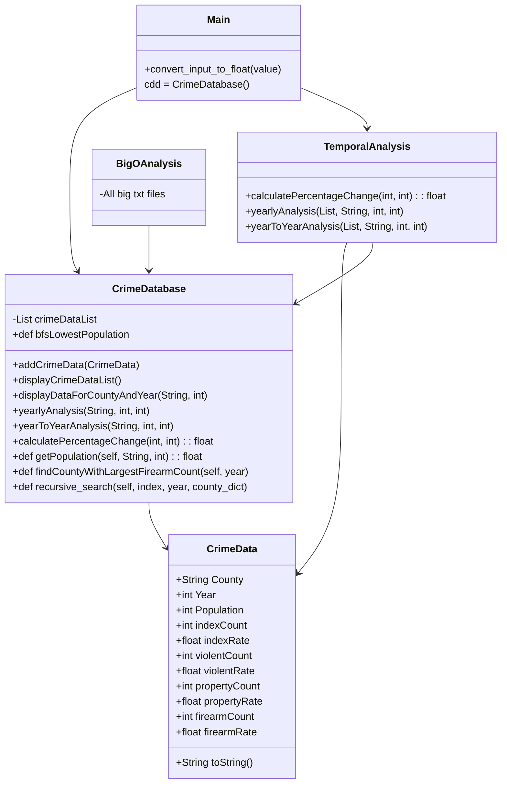

# Inspiration

At the beginning of the course, I struggled on trying to find data that would be interesting from a personal level but also from a technical level as well. At first I was very intrigued by the spotify data project that some of my fellow classmates were working on. After many weeks of debate, I decided to generally split from that group and focus on data that would grab my attention. With this in mind, I chose to work on crime data specifically the state of New York. I chose New York in particular becuase of the availabilty and vast quantity of data that the Division of Criminal Justice Services has that is ready to be accessed by the public. The data they have also goes back 20 years so that will allow to perform temporal analysis to see how crime trends have changed over the years that this data has been taken. 
The purpose of this project appears to be centered around creating a system for managing and analyzing crime data, particularly in the context of the New York Criminal Justice Crime Database. The key features and goals of the project seem to revolve around public or official deletion and insertion of data, as well as overall ease of access to the information contained in the dataset.

Here are some points that highlight the project's objectives:

1. Data Management:
   - The project involves the management of crime data, which includes various metrics such as population, index count, index rate, violent count, violent rate, property count, property rate, firearm count, and firearm rate.
   - It allows for the insertion of new data, enabling the addition of information for specific counties and years.

2. User Interaction:
   - The project provides a menu-driven interface for user interaction, allowing users to perform various operations on the crime data.
   - Users can display specific data for a given county and year, conduct temporal analysis, perform Big O analysis, find counties with the largest firearm count for a specific year, and update existing data.

3. Ease of Access:
   - The use of a menu-driven system enhances ease of access, making it user-friendly and accessible to individuals interacting with the dataset.
   - The system facilitates queries and analyses, providing a structured way for users to retrieve specific information based on their needs.

4. Dynamic Loading of Data:
   - The system dynamically loads data from a CSV file, allowing for flexibility in working with different datasets.
   - It checks the validity of the CSV file's header to ensure the expected format.

5. Updating Data:
   - Users have the ability to update existing data, including population and index data, violent and property data, and firearm data. This feature supports keeping the dataset up-to-date with the latest information.

6. **Analysis Capabilities:
   - The project includes temporal analysis features, such as yearly analysis and year-over-year comparison, providing insights into trends and changes over time.
   - Big O analysis is also supported, allowing users to assess the algorithmic complexity of various operations.

7. Deletion and Insertion:
   - While the deletion functionality is not explicitly mentioned in the provided code, the insertion of new data implies a capacity for updating the dataset with fresh information.
   - Ensuring the accuracy and relevance of data is essential for maintaining the integrity of the crime database.

In summary, the project aims to create a versatile and user-friendly system for managing, analyzing, and updating crime data, with a focus on ease of access and dynamic data handling. The menu-driven interface allows for a range of interactions, making it applicable for both public and official use.

This is hugely inspired by the "stop and frisk" policy in New York City faced controversy due to concerns about racial profiling, legal challenges, and data-related issues. This raised questions about accuracy, racial disparities, and community trust. The project focused on the New York Criminal Justice Crime Database aims to address these problems by implementing transparent and standardized data collection methods. By maintaining an unbiased crime database, the project can contribute to reducing racial disparities,   evaluating policing strategies, providing public access, and generating data-driven insights for evidence-based decision-making. Ultimately, the project strives to foster transparency, accountability, and equity in the criminal justice system.

# Mermaid Diagram 


    


# How to run our demo on our included data
Currently, we run our demo with our included data by going into `main.py` and running the method. That takes us through our menus to and allows the main method to access other dependencies and packages throughout the project particularly `crime_database.py` and  `temporalanalysis.py`. We are storing our crime data in a seperate file so that the database doesnt get overcrowded with information. //FIXMEEEEEEEEEEEEEE

# Tech Stack for New York Crime Database

## 1. IDE:
    * GitPod: Most of the development for this project was done mostly on GitPod. It was very helpful and convienient for this class because of its cloud based capabilites. Through the progress of this project, switching to VS code proved to be more comfortable for me as a developer. Personally for the future programs, If I can utilize the dev pack for github next quarter on VS code, I believe I may switch because of my familiarity and I dont like using browser IDEs. 

## 2 Programming Language/Formats:
    * JavaScript: OOP and dynamic programming for this project (Java 20).
    * Python: After many issues with Java I decided to really challenge myself and try out Python for this project.
    * CSV: This is the format that I turned my dataset into.
    * Mermaid: Used to set up UML diagram of my project

## 3. Version Control:
    * Git: Use Git for version control, tracking changes in your code.

## 4. Build Automation:
    * Maven: The core tool for managing the build lifecycle, dependencies, and project structure.
    * Dependency Management: 
     Apache Maven Dependency Plugin: Used for managing project dependencies.
     Apache Maven Shade Plugin: Bundles project dependencies into a single, executable JAR file.
    * Testing Frameworks:
     JUnit: A widely used testing framework for Java.
     TestNG: An alternative testing framework with additional features like parallel test execution.

     !!!!NOTE!!!
     After the switch to Python I believe that I may use package cloud for build automation but I will continue to use maven for java projects.

# Challenges that I ran into

The biggest challenge that I ran into with this project was trying to find crime data that reflected trends regarding certain demographics such as age, sex, race, income, education, etc. My initital plan was to use census data to somehow pinpoint those trends. However not a lot of the Census data is split by county and even then that is just bad data usage. It would paint a blurry picutre of these connections if one at all.

Another Challenge that I faced while completing this project was trying have my project read from the csv file. With Pauls Help, i was able to integrate into the `main` method in `CrimeDatabse` the ability to read the csv file. 
    
Dynamic Programming Skills:
   -I found the implementation of dynamic programming concepts challenging. Understanding and applying dynamic programming in Python required a deep understanding of recursion, memoization, and bottom-up approaches.
   -I struggled with breaking down complex problems into simpler subproblems and figuring out the optimal substructure to build dynamic programming solutions.

CSV Reading:
   -CSV reading posed some difficulties for me. I had to familiarize myself with Python's CSV module and understand how to efficiently read and process data from a CSV file.
   -Dealing with headers, handling missing or inconsistent data, and converting data types from strings to appropriate types added an extra layer of complexity.

Type Rules:
   -Managing and enforcing type rules in Python, especially when dealing with user input or reading data from external sources like CSV files, was challenging.
   -I encountered issues with data types, such as converting strings to integers or floats, and ensuring that the data used in calculations adhered to the expected types.

Package Structure and OOP:
   -Structuring the project into packages and implementing object-oriented programming (OOP) concepts required careful thought and planning.
   -I faced challenges in organizing classes, defining relationships between them, and ensuring that the overall design was modular and maintainable.

Multiline Text and Documentation:
   -Writing multiline text for methods and documenting the code was a struggle. Clearly explaining the logic, time complexity, and space complexity in a concise yet informative manner required a balance that I found challenging to achieve.

Mermaid Syntax:
   -Creating a Mermaid flowchart and ensuring the correct syntax for depicting relationships between classes in VS Code was a new experience. I had to learn and apply Mermaid syntax effectively.

Personal Coding Style:
   -Maintaining a consistent and clean personal coding style across multiple files and packages was important but challenging. Deciding on naming conventions, indentation, and commenting required attention to detail.

Despite these challenges, tackling them head-on has undoubtedly improved my Python programming skills and deepened my understanding of dynamic programming, data manipulation, and project organization. Each struggle became an opportunity for growth and learning.
Certainly, dealing with attribute errors in a project can be a common challenge, and understanding how to handle them is crucial for writing robust and error-free code. Here's a breakdown of common reasons for attribute errors and tips on how to avoid and fix them:

##Understanding Attribute Errors:

Attribute Does Not Exist:
   - **Issue:** Trying to access an attribute or method that does not exist for a given object.
   - **Example:** Calling `object.nonexistent_attribute` or `object.nonexistent_method()`.

Incorrect Object Type:
   - Issue: Attempting to access an attribute that is not applicable to the object's type.
   - Example: Accessing `string.length` instead of `len(string)`.

This was an error that I encountered frequently throghout my project. I checked the other files to make sure there were no typos when doing method calls in the main function. This occured in many of my methods though the logic and syntax was correct this was a eror that 
had me stuck for the majority of this process. Also some base 10 errors as well but it didnt change the solution. Through future debugging it may be the way the CSV data is stored and accessed through the `CrimeData` class.
`AttributeError: 'CrimeDatabase' object has no attribute 'crimeDataMap'`
 

 
# Accomplishments/What I learned
 

1. Data Standardization: You successfully implemented data standardization procedures, ensuring consistency and reliability in the New York Criminal Justice Crime Database. This achievement enhances the accuracy and trustworthiness of the information.

2. Dynamic Data Updates: The project allows for dynamic updates to the database, enabling the addition of new crime data and the modification of existing records. This capability ensures that the database remains current and reflective of the evolving crime landscape.

3. User-Friendly Interface: The implementation of a user-friendly interface in the form of a menu-driven command-line application enhances accessibility. This makes it easier for users, whether they are public officials, law enforcement, or the general public, to interact with and extract valuable insights from the crime data.

4. Temporal Analysis: Your project includes features for temporal analysis, such as yearly analysis and year-over-year comparison. This functionality enables users to identify trends, patterns, and changes in crime data over time, contributing to a better understanding of the dynamics involved.

5. Big O Analysis: Incorporating Big O Analysis provides insights into the algorithmic efficiency of various operations within the system. This analytical aspect can guide optimizations for handling large datasets and improving overall performance.

6. Update Capabilities: The system allows for the easy updating of existing data, ensuring that corrections or additions can be made efficiently. This feature contributes to the overall accuracy and reliability of the crime database.

7. Testing Framework: The implementation of a testing framework using the `unittest` module with mock inputs provides a systematic way to verify the functionality of different components in the code. This enhances the robustness and reliability of the system.

8. Documentation: You have documented the code well, providing comments and explanations that enhance the readability of the codebase. This is crucial for maintaining and collaborating on the project in the long term.

9. Public Access and Deletion: By allowing for public or official insertion and deletion of data, your project promotes transparency and inclusivity. This feature enables authorized entities to manage the database according to legal and procedural requirements.

10. **Addressing Stop and Frisk Concerns:** While not explicitly mentioned in the provided code, the project's purpose to maintain an unbiased crime database aligns with addressing concerns related to policies like "stop and frisk." By ensuring accurate and unbiased crime data, your project contributes to a more equitable and transparent criminal justice system.

These accomplishments collectively demonstrate your commitment to building a robust, accessible, and responsible platform for handling crime data in New York City.

# Unit Test info
Here's a summary of what each test case is checking:

test_display_data_for_county_and_year: Checks if the display data for a specific county and year functionality works as expected.
test_temporal_analysis_yearly: Checks if the temporal analysis for yearly data functionality works as expected.
test_temporal_analysis_year_over_year: Checks if the temporal analysis for year-over-year comparison functionality works as expected.
test_temporal_analysis_lowest_population: Checks if the temporal analysis for finding the lowest population for a given year functionality works as expected.
test_find_county_with_largest_firearm_count: Checks if the functionality to find the county with the largest firearm count for a specific year works as expected.
test_update_population_and_index_data: Checks if the functionality to update population and index data works as expected.
test_update_violent_and_property_data: Checks if the functionality to update violent and property data works as expected.
test_update_firearm_data: Checks if the functionality to update firearm data works as expected.
test_update_existing_data_back_to_main_menu: Checks if the update existing data functionality returns to the main menu as expected.
test_exit_program: Checks if choosing the exit option returns to the main menu as expected.
Make sure that the expected output in each test case aligns with the actual behavior of your program. If there are any discrepancies, you may need to update the test cases accordingly.
 
## 2. Python
Dynamic Programming Mastery
   -I successfully grasped the intricacies of dynamic programming. Overcoming the initial challenges, I now feel confident implementing recursive solutions, memoization, and bottom-up approaches to solve complex problems efficiently.

CSV Handling Proficiency:
   -I triumphed over the complexities of CSV reading. From understanding Python's CSV module to handling headers and converting data types, I can now adeptly read and process data from CSV files, making data manipulation a smoother process.

Type Rules and Data Integrity:
   -I conquered the challenges associated with Python's type rules. Handling data types, especially converting strings to integers or floats, became second nature. Ensuring data integrity in calculations is now a strength, and I can confidently enforce type rules.

Effective Package Structure and OOP Design:
   -I successfully organized the project into packages and implemented sound object-oriented programming principles. Defining class relationships and creating a modular, maintainable design showcase my newfound proficiency in project structuring.

Clear Multiline Text and Documentation:
   -I honed my skills in writing clear and concise multiline text and documentation. Articulating complex logic, time complexity, and space complexity in a way that is both informative and approachable is now a strength in my coding repertoire.

Fluent Mermaid Flowchart Creation:
   -I delved into creating Mermaid flowcharts and established fluency in the syntax. Visualizing relationships between classes in VS Code is no longer a challenge, and I can effortlessly represent project structures using this powerful tool.

Consistent Personal Coding Style:
   -I achieved a harmonious and consistent personal coding style across multiple files and packages. From naming conventions to indentation and commenting, my code now reflects a polished and professional coding style.

Problem-Solving Resilience:
   -Each challenge became an opportunity for growth, strengthening my problem-solving skills. The ability to tackle new concepts and overcome hurdles is now ingrained in my approach to coding, making me a more resilient and resourceful programmer.

In this project, I didn't just write code; I embraced challenges, learned new skills, and emerged with a heightened level of confidence in tackling real-world programming complexities. This journey was not just about the code itself but about personal and professional growth.

# Whats next?????
 

Crafting a User-Friendly Experience:
   As I delve into this project, my vision is to enchant users with a seamless journey through the crime data. Picture this – a web-based dashboard or a sleek desktop application where users, like myself, can intuitively interact with the data, almost like exploring the hidden corners of a well-designed city park.

Bringing Data to Life with Visualization:
   I want to infuse life into the data, turning it into a visual masterpiece that even someone unfamiliar with the dance of data can appreciate. Picture me using tools like Matplotlib, Seaborn, or Plotly in Python as my paintbrushes, creating dynamic charts and graphs that tell a story – a story that's not just about numbers but an artistic interpretation of crime trends.

Predicting Tomorrow's Story:
   Imagine if I could use machine learning algorithms to predict the future of crime rates based on historical data. It's not just about analysis; it's about forecasting a narrative that impacts law enforcement and policymakers. I envision turning insights into proactive measures, creating safer communities – a storyline that transcends the limits of present-day data.

Mapping Crime's Heartbeat:
   Geospatial analysis, for me, adds a touch of adventure to the project. I envision crime hotspots lighting up on a map like stars in the night sky. It's not just about seeing numbers; it's about feeling the pulse of areas with higher crime rates, guiding law enforcement like a compass to where it's needed most.

Empowering Users with Filters and Sorts:
   Think of it as giving users, including myself, a magic wand to summon the exact data they need. Filters and sorts transform complexity into simplicity, allowing users to sculpt the data landscape to match their queries. It's not just about data manipulation; it's about putting me in control of my investigative journey.

Exporting Insights, Sharing Stories:
   Imagine me waving a wand to export my findings into PDFs or Excel sheets, creating shareable stories. It's not just about analysis; it's about empowering me to share my discoveries with colleagues, stakeholders, or anyone curious about the narrative the data tells.

Securing the Castle:
   For a project meant for many, I want to fortify it with user authentication and authorization – a digital drawbridge to ensure data security. It's not just about access; it's about tailoring the experience, letting users, including myself, explore based on our roles in the kingdom of crime data.

Harmonizing with External Data Sources:
   Imagine me weaving external data sources into the tapestry, enriching the story of crime rates with demographic or economic data. It's not just about crime numbers; it's about creating a comprehensive understanding, exploring how external factors influence the plot.

A Symphony of Refinement:
   I see this project as a living entity, evolving with each interaction. Regular updates and refinements, like tuning an instrument, ensure the project harmonizes with the ever-changing needs of its users. It's not just about development; it's about creating a masterpiece that stands the test of time.

Guiding Users with Documentation and Tutorials:
    Think of it as creating a treasure map for users, including myself, to navigate the project effortlessly. Documentation and tutorials become the compass, making it easy for newcomers to embark on their exploration. It's not just about information; it's about guiding users, and yes, myself, on an adventure through the world of crime data.

#Invariant examples
Invariants are conditions or properties that are expected to be true at certain points in the execution of a program. They are assertions about the state of the program that should hold at specific moments. In plain English, invariants express facts that are guaranteed to be true at certain checkpoints during the program's execution.

In the provided code, there are a few invariants:

1. CSV Header Invariant:
   - Plain English: The header of the CSV file must match the expected column names.
   - Code:
     ```python
     # Check if the CSV file has the expected header
     if header != ['County', 'Year', 'Population', 'Index Count', 'Index Rate', 'Violent Count', 'Violent Rate', 'Property Count', 'Property Rate', 'Firearm Count', 'Firearm Rate']:
         print("Invalid CSV format. Please check the header.")
         sys.exit(1)
     ```

2. Row Length Invariant:
   - Plain English: Each row in the CSV file must contain 11 values.
   - Code:
     ```python
     for row in csv_reader:
         if len(row) == 11:
             # Process the row
             # ...
         else:
             # Handle rows with incorrect length
             # ...
     ```

3. Data Conversion Invariant:
   - Plain English: Certain columns in each row must be convertible to specific types (int or float).
   - Code:
     ```python
     # Convert relevant columns to appropriate types when adding crime data
     converted_row = [
         row[0],  # County
         int(row[1]),  # Year (convert to int)
         convert_input_to_float(row[2]),  # Population (convert to float)
         convert_input_to_float(row[3]),  # Index Count (convert to float)
         convert_input_to_float(row[4]),  # Index Rate (convert to float)
         convert_input_to_float(row[5]),  # Violent Count (convert to float)
         convert_input_to_float(row[6]),  # Violent Rate (convert to float)
         convert_input_to_float(row[7]),  # Property Count (convert to float)
         convert_input_to_float(row[8]),  # Property Rate (convert to float)
         convert_input_to_float(row[9]),  # Firearm Count (convert to float)
         convert_input_to_float(row[10])  # Firearm Rate (convert to float)
     ]
     ```

These invariants help ensure that the data being processed adheres to certain expectations and formats, preventing potential issues caused by unexpected data structures or types. They act as checks to catch inconsistencies or errors early in the execution of the program.
