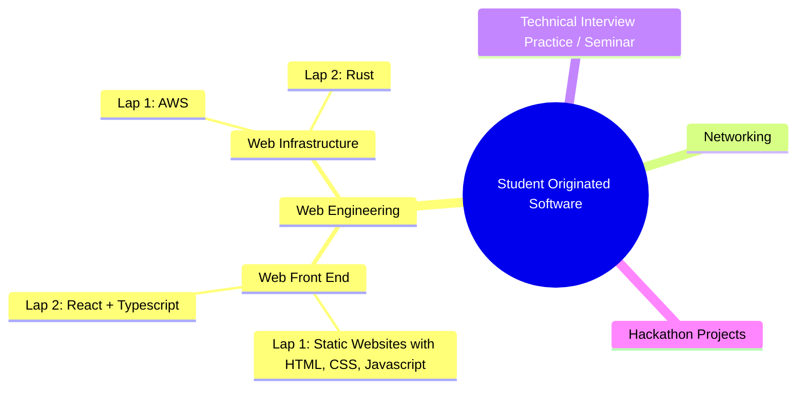

## Web Engineering Syllabus
Winter 2024

## Learning Goals
* To understand the full stack of web applications, including front-end components and infrastructure.
* To become fluent in managing, navigating, and thinking about code as source files in a nested directory tree.
* To become fluent in tracking, versioning, and collaborating on software with Git and GitHub.
* To become fluent in HTML, CSS, and Javascript (in Lap 1) and 
* To practice technical interview skills and communicating about code to other humans through weekly mock interviews of submitted code and work.
* To complete a web application of at least 500 lines of code in teams.

![[./images/web-architecture.png]]

## Tracks and Laps

Web Engineering has two tracks. Within each track, students who are taking it the first time should take Lap 1. Students taking it for the second time should take Lap 2.

The main video courses and texts for each section are shown below.

### Track: Web Infrastructure
#### Lap 1: Cloud, Back-end
* [Fullstack for Front-End Engineers](https://frontendmasters.com/courses/fullstack-v3/)
* [NodeJS and API Design](https://frontendmasters.com/courses/api-design-nodejs-v4/)

#### Lap 2: Rust
* For first-time Rust programmers, we will be following this interactive book
	* https://rust-book.cs.brown.edu/
* For additional explanations
	* [The Rust Programming Language](https://frontendmasters.com/courses/rust/)

### Track: Web Front-End
#### Lap 1: Static Websites (HTML, CSS, JavaScript)
* [Complete Intro to Web Development v3]()

#### Lap 2: React + Typescript
* For students who have already taken Lap 1 or know how to make a static site.
* [React + Typescript](https://frontendmasters.com/courses/react-typescript-v2/)
	* For Lap 2 students, all work will be done with Typescript in SOS
* [Intermediate React](https://frontendmasters.com/courses/intermediate-react-v5/)
* [React Performance (React)]()

#### Lap 3: Independent Topics
* By permission of instructor: for students who already have taken or know material in Lap 2 and Lap 1.
* You can choose
* React Native
	* https://frontendmasters.com/courses/react-native-v2/
* Creative Coding (Canvas, WebGL, ThreeJS)
	* https://frontendmasters.com/courses/canvas-webgl/

## Attendance and Zoom Policy
In Web Front-End and Web Infrastructure, attendance is required in-person. A Zoom option will be provided for students in-person who wish to ask questions by text. The primary means of submitting work is through Github into the class monorepo, and the primary means of evaluation will be 1:1 code interviews with the instructor or a TA. A big use of our classtime will be practicing this interview format with pair programming partners.

We are committed to supporting an accessible learning environment for all students.
  

Students will be asked not to use AI for this class. They are asked to type character-by-character every line of code that they submit under their own name as their own work in github (no copy and paste), and certify that they can communicate and teach in English to another human A) how to come up each line of code, B) what it does, and C) how it contributes to the desired solution.

##   

## Assessments and Evaluations

### Code Interview
You do not have to have completed that week's assignment to do the code interview, as long as you have spent about 6 hours total thinking, reading, and coding.

If you are still learning to commit and push to GitHub with branches and pull requests, bring your laptop or be prepared to log into the cloud development environment where you have your work (GitPod or GitHub Codespaces).

If you are able to commit and push to GitHub, commit and push your changes to a branch and add to a pull request as a work-in-progress (WIP).

The format of the weekly 1:1 code interview is, within a 10 minute interview each week:

- Tell the interviewer about your code.
	- A guideline to get started: divide up your code into 3 to 5 major pieces,
	- then summarize them in order

- Interviewer will
	- remove x lines of code from your submitted work at random
		- In week 2 we will remove 2 lines of code.
		- In each successive week, the interviewer will remove one more line of code until Week 10, when 10 lines of code will be removed.
	- ask you to talk through your process of how would you determine what the change was
	- ask you to add back the removed lines of code to restore functionality

  

Students who pass at least 5 out of 8 code interviews, add to at least 5 out of 8 co-creation files each week, and complete a final project meeting at least 5/8 of each requirment will receive full credit.

## Anticipated Credits

The main three tracks of SOS worth 12 credits (most students will be taking this version).

| Credits | Description |
| ---- | ---- |
| 4* | Infrastructure Software Engineering for the Web |
| 4* | Front End Software Engineering for the Web |
| 4* | Computer Networking |

Optional tracks, meeting on
* Monday afternoon (Technical Software Interview Skills includes Seminar)
* Friday morning (Hackathon Projects)

| Credits | Description |
| ---- | ---- |
| 2* | Technical Software Interview Skills |
| 2* | Hackathon Projects |
|  |  |
## Interactions Between Tracks
Students may be enrolled in one, two, or all three of the Front End, Infrastructure, and Networking tracks, and will be working in teams across all three tracks on their DSA final projects from fall quarter, or a new project that evolves over winter quarter.

* Front End students will be implementing a web app, with a client-side browser component
* Infrastructure students will be making the web app publicly accessible under a registered domain name, continuously integrated / deployed, reproducibly-built, with maximum uptime.
* Networking students will be analyzing the interactions between client-side and server-side components of the above teams, and helping them debug connectivity and security problems

These emulate product teams in software companies, in which engineers with different specialties divide up work and then integrate them with each other. Students who specialize in one track (e.g. Networking) may choose to take SOS again next year with a different specialization (e.g. Infrastructure).

## Required Textbooks by Track

TAs will receive used desk copies or PDFs of the readings, see Paul at beginning of the quarter.

[_Computer Networking_ by Kurose and Ross (8th edition)](https://www.pearson.com/en-us/subject-catalog/p/computer-networking/P200000003334/9780135928615), ISBN
[_HTML and CSS_ by Duckett](https://htmlandcssbook.com/), ISBN

## Optional Readings (for Seminar)

[_Literate Programming_ by Knuth](http://www.literateprogramming.com/knuthweb.pdf)
[_Computer Lib / Dream Machines_ by Ted Nelson](http://worrydream.com/refs/Nelson-ComputerLibDreamMachines1975.pdf), ISBN
[_The Visual Display of Quantitative Information_ by Edward Tufte](https://www.edwardtufte.com/tufte/books_vdqi), ISBN
## Schedule 

|  |  |  |  |  |  |
| ---- | ---- | ---- | ---- | ---- | ---- |
|  | Mon | Tues | Wed | Thurs | Fri |
| 10-12 | Web Infrastructure   (LIB 2619) | Web Front End   (LIB 2619)  |  | Web Front End (LIB 2619)  | Software Projects  (LIB 2619) |
| 1-3 | Technical Interview Practice  Seminar (LIB 2619) |  |  | Web Infrastructure  (LIB 2619) | Networking  (LIB 2610) |
| 4-6 |  | Networking    (LIB 2610) |  |  |  |
|  |  |  |  |  |  |
|  |  |  |  |  |  |
## Topic List
These are subject to change as the quarter progresses.

| Week | Web Front End | Web Infrastructure |
| ---- | ---- | ---- |
| 1 | git review, HTML, CSS | AWS instances, DNS |
| 2 | Layout and Box Model |  unix review, telnet, curl, nc, netstat, GitHub Pages, cron |
| 3 | Buttons and Forms | Databases |
| 4 | CSS / SVG animations | Continuous Integration |
| 5 | APIs, Auth secrets | Testing |
| 6 | Storage, Cookies | Monitoring / alerting |
| 7 | Fetch (AJAX) | Docker / Containers |
| 8 | D3.js | Decentralized services |
| 9 | Threejs / WebAudio / ILCs | Our own REST server |
| 10 | Final Project / Demo Day | Final Project / Demo Day |

