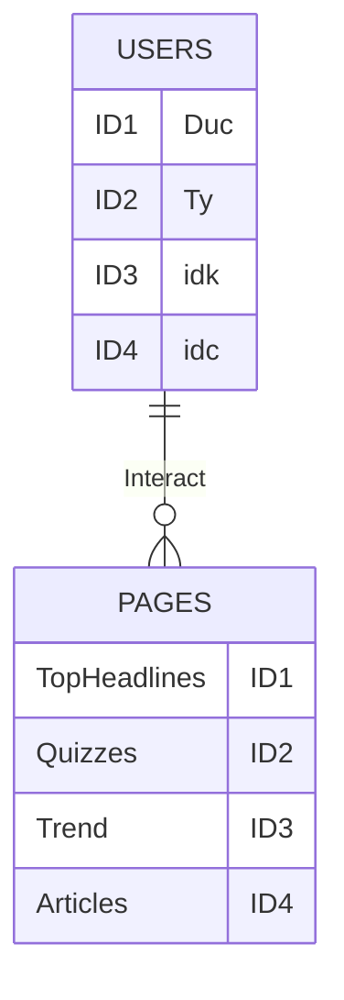

USER TABLE

| ID | Username |
|----|----------|
| 1  | Duck     |
| 2  | Ty       |
| 3  | Idk      |
| 4  | Idc      |

PRODUCT/INTERACTIVE TABLE

| ID | Interaction   | belongsToUserID |
|----|---------------|-----------------|
| 1  | Top Headlines | 1               |
| 2  | Quizzes       | 2               |
| 3  | Trend         | 3               |
| 4  | Article       | 4               |

5 questions/details for the schema
1. I don't understand the schema really well ie. how it interacts with the users
2. I like the details of the schema, really nice you got it encapsulate
3. How could the html interact with the server?
4. Is my schema seems right to you?
5. I don't know, I'm tired

