# GitGraph Practice

These are the visualization of our the git branch

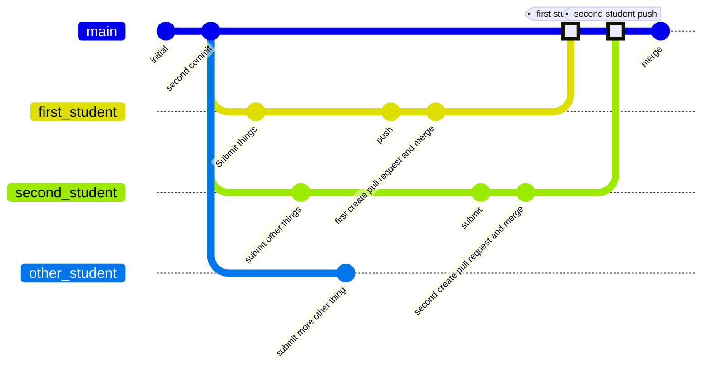

## Start Fresh
Start with a fresh clone, your local repo is the same as the remote, no feature branches, just `main`.

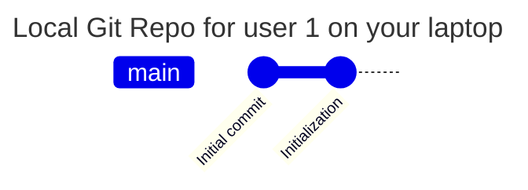

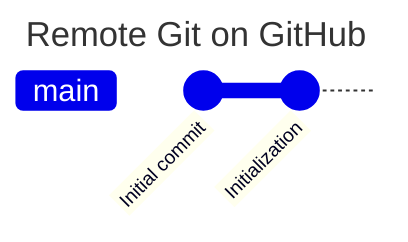


## Develop Locally

Develop locally on your laptop with commits "def" and "000"

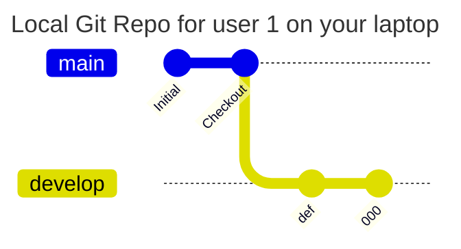

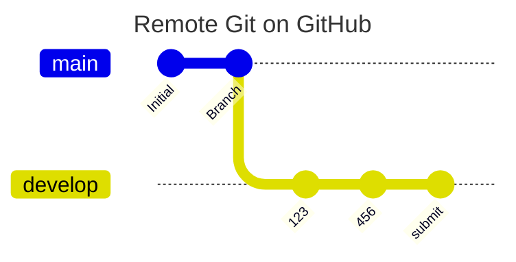

## Open Pull Request, Code Review, Merge

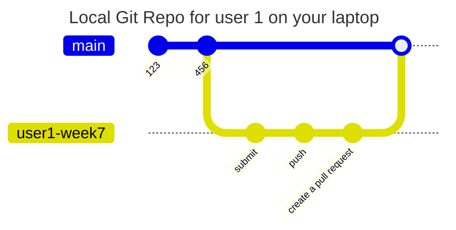

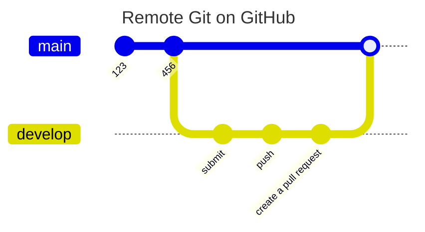

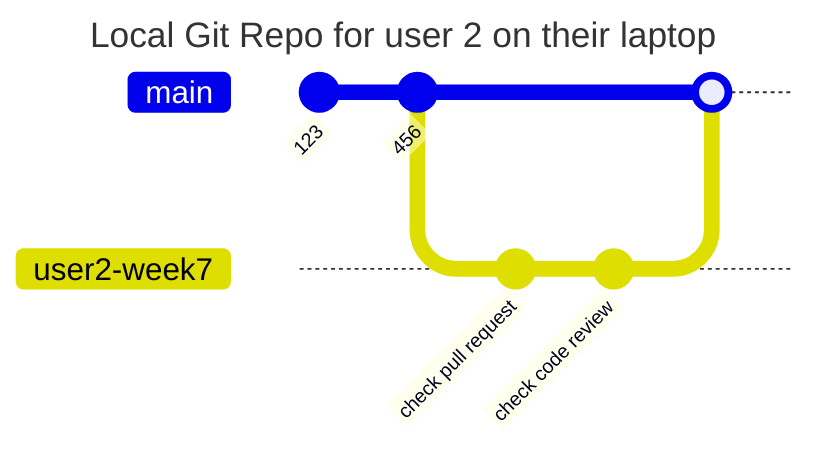

# Some mistake while doing git in this repo

## Git Push To Remote *on Branch*, not main

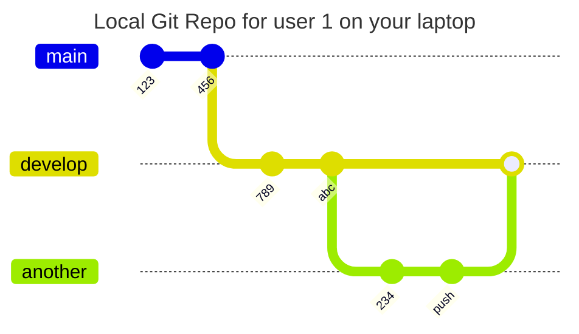

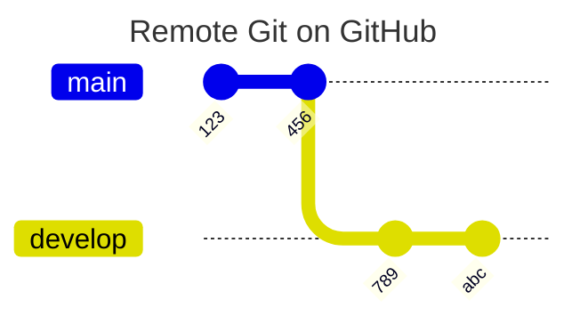

## User 2 Accidentally Pulls from Main

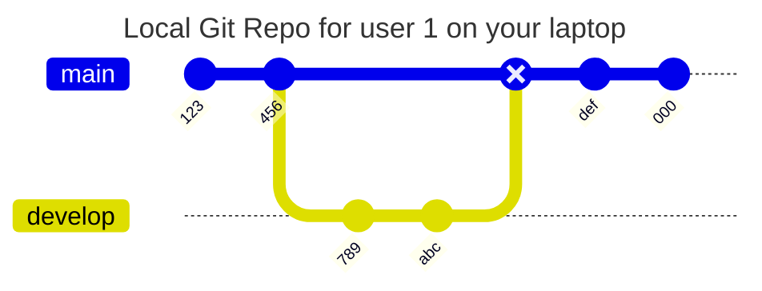

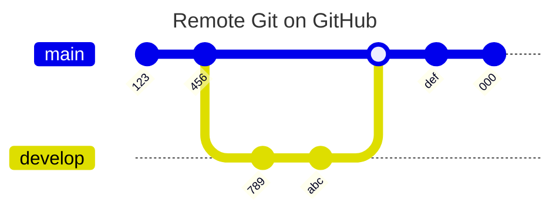

If `user2` is on their own personal branch `user2-week7` and they
call

```
git pull origin main
```
by accident, or even worse, connect the upstream of `user2-week7` with
another branch by accident,
```
git pull
```

 they will get changes that are not theirs,
possibly many of them from the distant past.

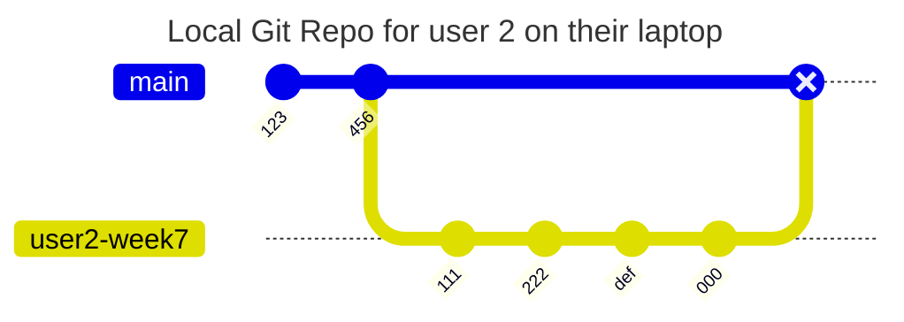
