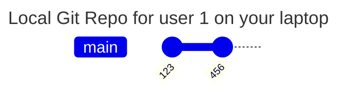
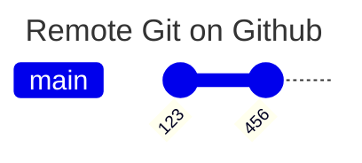
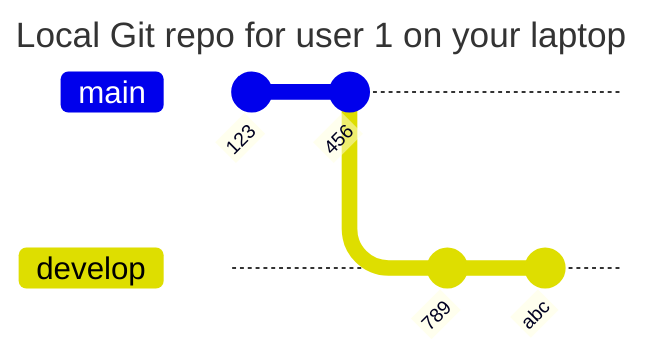
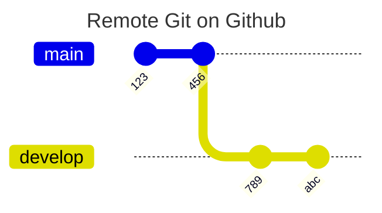

## Develop Locally

Develop locally on your laptop with commit "def" and "000"

from local clone new code 
`git branch <develop branch>`

`git checkout <develop branch>`

`git add <filename>`

`git commit -m <message>`

`git add <filename>`

`git commit -m <message>`

## Git Push To Remote *on Branch*, not Main

