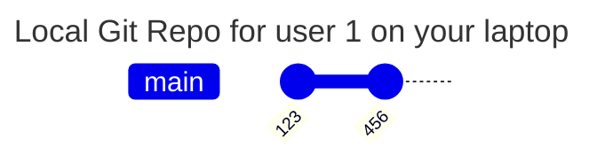
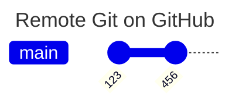
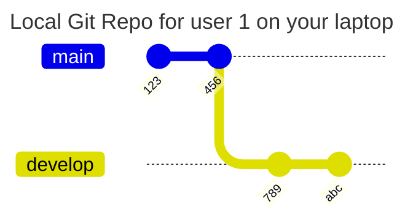
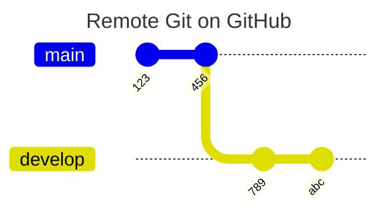

# GitGraph Practice

One common cause of errors:

## Start Fresh
Start with a fresh clone, your local repo is the same as the remote, no feature branches, just `main`.

## Develop Locally

Develop locally on your laptop with commits "def" and "000"

## Git Push To Remote *on Branch*, not main

