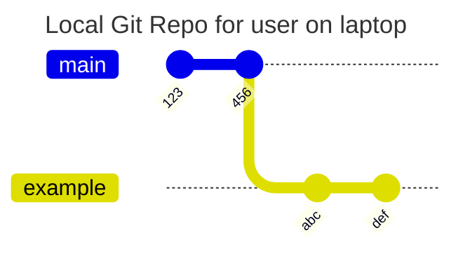

# Week 7 readme file with mermaid

```mermaid
---
title: Local Git Repo for user on laptop
---

gitGraph
    commit id:"123"
    commit id:"456"
    branch example
    checkout example
    commit id:"abc"
    commit id:"def"

```