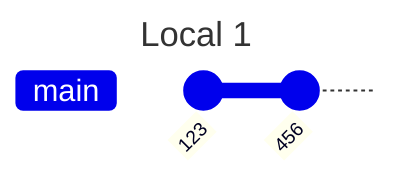
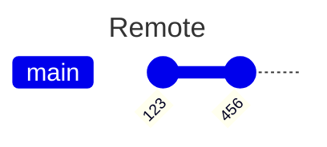
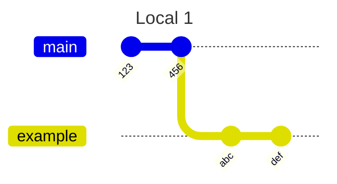
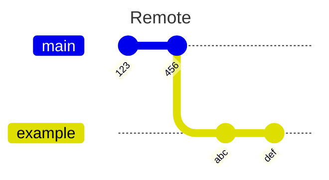
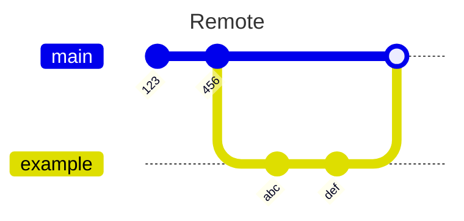
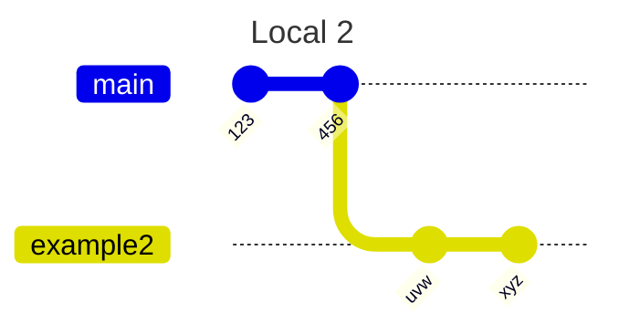
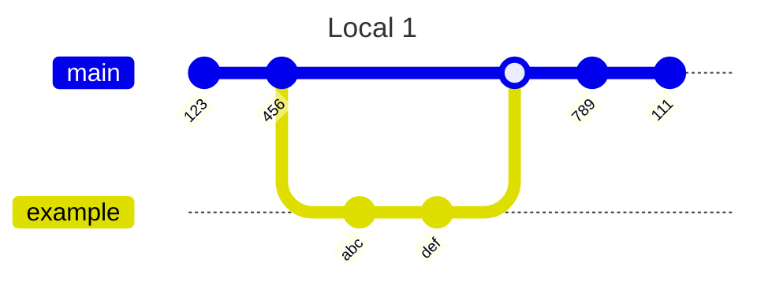
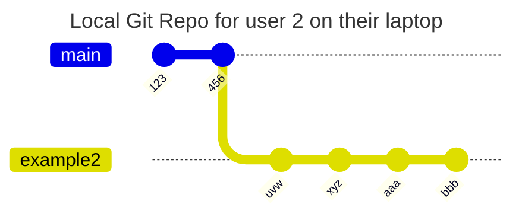

# Week 7 readme file with mermaid gitGraph


## Start Fresh

Fresh clone:



## Develop Locally

Develop new things on branch `example`




## Git push to remote on branch, not main. 



## Open Pull Request, Code Review, Merge





## User 2 Accidentally Pulls from Main



If `Local 2` is on `example2` and they call 
```
git pull origin main
```
they could get changes that arent theirs, Possibly from the past. 

