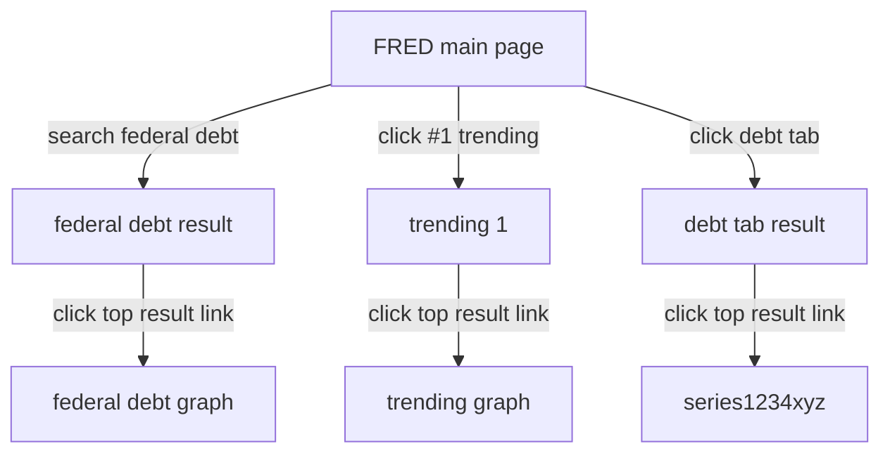

### Readme from in class assignment. 

This post was worked on by Dante and Taylor. 

Here is a mermaid flowchart of the physical flowchart we recived in class. It is Nathan Deanon's paper that we worked off of. 

#### Answers to questions
 
1. With the “trending” and “category” headers, how are you planning to lay these out/represent them? What’s the main purpose of having these? 
2. Are you designing a Google clone or are you planning to implement features Google doesn’t have?  
3. How is formatting going to function with having the filter bar on the left side? Is it going to have multiple uses? And will it complement your design or will it create limitations? 
4. What selections do you plan to have with your UI? Like are the filter bars/subpages going to always be present or only show up when asked/selected? 
5. I don’t seem to understand your “Title, Graphs, Notes” page? What does this do exactly?