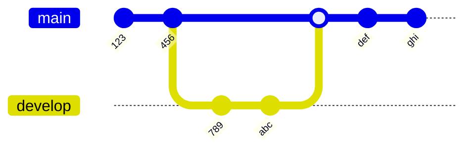
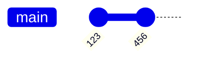

```mermaid
---
Git Diagram
---

gitGraph
    commit id:"123"
    commit id:"456"
    branch develop
    checkout develop
    commit id:"789"
    commit id:"abc"
    checkout main
    merge develop
    commit id:"def"
    commit id:"ghi"
```
    

```mermaid
---
Local Git Repo for user 1 on your laptop
---
gitGraph
    commit id:"123"
    commit id:"456"
```

```mermaid
---
Remote Git on GitHub
---
gitGraph
    commit id:"123"
    commit id:"456"
```
