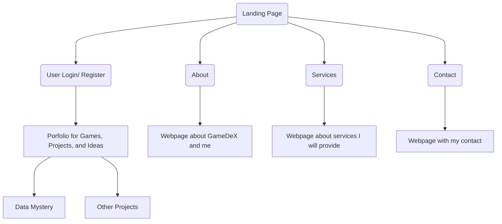
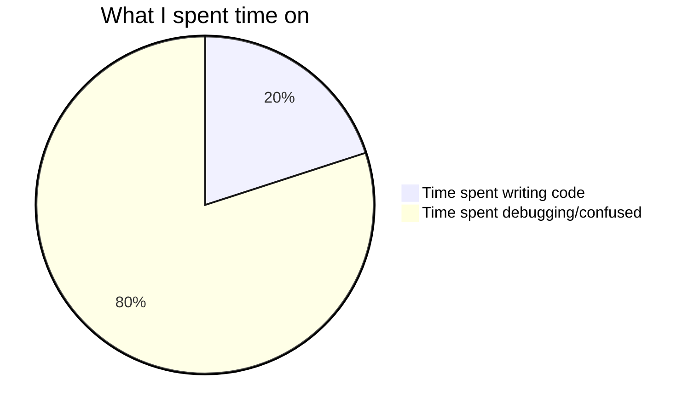

<!-- Improved compatibility of back to top link: See: https://github.com/othneildrew/Best-README-Template/pull/73 -->

<!--
*** Thanks for checking out the Best-README-Template. If you have a suggestion
*** that would make this better, please fork the repo and create a pull request
*** or simply open an issue with the tag "enhancement".
*** Don't forget to give the project a star!
*** Thanks again! Now go create something AMAZING! :D
-->

<!-- PROJECT SHIELDS -->

<!--
*** I'm using markdown "reference style" links for readability.
*** Reference links are enclosed in brackets [ ] instead of parentheses ( ).
*** See the bottom of this document for the declaration of the reference variables
*** for contributors-url, forks-url, etc. This is an optional, concise syntax you may use.
*** https://www.markdownguide.org/basic-syntax/#reference-style-links
-->
[![Contributors][contributors-shield]][contributors-url]

<!-- PROJECT LOGO -->

<br />
<div align="center">
  <a href="https://github.com/TheEvergreenStateCollege/upper-division-cs/tree/main/web-24wi/assignments/ndeanon25/infra/api-design">
    
  </a>

<h3 align="center">GameDeX</h3>

<p align="center">
    Welcome to GameDex! This will be a portfolio for all my games, ideas, and projects. 
    It will serve as a platform to continue my thought process and further develop my skills. 
    Through GameDex, my goal is to share my passion for software development and contribute to the community. 
    <br />
    <a href="https://github.com/TheEvergreenStateCollege/upper-division-cs/tree/main/web-24wi/assignments/ndeanon25/infra/api-design"><strong>Explore the docs »</strong></a>
    <br />
    <br />
    <a href="https://www.linkedin.com/feed/update/urn:li:activity:7175577341241303040/">View Sign in Page</a>
    <a> || </a>
    <a href="https://www.youtube.com/watch?v=E9zOaXOfmpo&feature=youtu.be"> View Data Mystery Demo</a>
  </p>
  
</div>

<!-- TABLE OF CONTENTS -->

<details>
  <summary>Table of Contents</summary>
  <ol>
    <li>
      <a href="#about-the-project">About The Project</a>
      <ul>
        <li><a href="#built-with">Built With</a></li>
      </ul>
      <li><a href="game-tree">User Flow Chart
    </li>
    <li>
      <a href="#inspiration">Inspiration</a>
      <ul>
        <li><a href="#inspiration">What Inspired Me</a></li>
        <li><a href="#getting-started-and-running-the-game">Getting Started and Running the Game</a></li>
      </ul>
    </li>
    <li><a href="#how-i-did-i-make-it-run">How I did I Make it Run</a></li>
    <li><a href="#challenges-i-ran-into">Challenges I ran into</a></li>
    <li><a href="#the-learning-experience">The Learning Experience</a></li>
    <li><a href="#accomplishments-I-am-proud-of">Accomplishments I am Proud of</a></li>
    <li><a href="#big-O()-and-data-structures-i-used">Big O() and Data Structures I used</a></li>
    <li><a href="#acknowledgments">Acknowledgments</a></li>
  </ol>
</details>

<!-- ABOUT THE PROJECT -->

## About The Project


This is GameDex. I wanted to create this project as it's on my bucket list; I have always wanted to create my own game. Data Mystery is an RPG inspired by my childhood.
My intentions are to help players understand different data structures while solving a case. Data Mystery will also have its own battle UI to make it more like a game rather than a lesson. 
These are all big picture ideas, and hopefully, future versions will introduce more features.
 
 <li> Github User : ndeanon25
 <li> Repo : Upper-Division-CS


### Built With

* 
* 
* 
* 
* 
* [![VSCode]][VSCode-url]
* Pain  / Headaches  / No Sleep
* Tears


<!-- Game Tree -->
## Game Tree

<p align="right">
<a href="#top" >Back to top</a>

<!-- Inspiration  -->

## Inspiration

Like in my last final project for DSA, my inspiration is the love for video games. GameDeX is going to be my portfolio for all my games and projects. 
GameDeX will not just showcase my games, but also serve as a platform for all my ideas and projects. 
I aim to continue this work and make my website public, sharing my passion for software engineering and learning with others. 
Through GameDeX, I hope to connect with fellow engineers and game enthusiast to collaborate on these exciting projects.

<p align="right">
<a href="#top" >Back to top</a>


## Software Design Diagram

GameDeX is still a work in progress, so the software design diagram is incomplete, I completed my back-end and front-end seperately

### Major Components of GameDeX v.1
<li> My API design from FrontEndMasters and Schema used in Render</li>
<li> Landing Page </li>
<li> Data Mystery </li>

### Relationships
<li> U</li>

<p align="right">
<a href="#top" >Back to top</a>


## Getting Started and Running the Game

1. Go to this Directory
   ```sh
   /workspace/upper-division-cs/dsa-23au/java-dsa/ndeanon25/src/main/java/com/ndeanon25/FinalProjectDSA
   ```
2. Run the file ImpossibleHangman.java with Java Red Hat Extension
   ```sh
   Download = Name: Language Support for Java(TM) by Red Hat
   ```
3. ENJOY THE GAME!!

<p align="right">
<a href="#top" >Back to top</a>


<!-- How I did I Make it Run -->

## How I did I Make it Run?!?


Magic. Really, this was a struggle. I made a gameplan and the very broad steps of getting there.

<li> Read from my dictionary file
<li> Get the input from the player
<li> Use HangmanLogic ( Behind the scenes)
<li> Start the Hangman game
<li> Lose

It seemed pretty simple to start but once I started, it seemed like the problem was only getting deeper and deeper. **I just divided and conquered.** I broke the gameplan into smaller gameplans and started from there. The DMV project helped me read a file and get it into my project. The inputs from the player are multiple if statements that I lost count of. The Hangman logic was the heaviest of the problems. 


<ins>**Tips and tricks**
<li>Understanding HashMaps and Sets are also helpful. 
<li>Tracking your objects and writing down where they are going and how they are being implemented is helpful.
<li>Writing your Junit test before you start your methods. This would have be so helpful because I did not do this, and I know now that how helpful writing Junit can be. 
<li>If doing a Junit test is too much, adding a debugger is super helpful. This could just be a print statement to show what you expect, which I did on my main method.

<p align="right">
<a href="#top" >Back to top</a>


<!-- Challenges I ran into-->

## Challenges I ran into

I changed my data structures like 7 times and most of the time I had a surface level understanding of what is I am implementing. StackOverFlow then finally led me to a TreeSet. It is a balanced tree, that uses Set. ChatGPT helped me implement it and figure out what I wanted to do. 


The method record alone took me over 2 hours. The textbook from class and StackOverFlow helped me write this code. Writing the psducode and trying to implement it and getting the right syntax is what took the most time. This method was the hardest for me. This method would record the user's guess and return a String representation of the word with the guessed char. Based on the guessed char, it will choose the next wordlist and then keep doing that every guess. 

One of the biggest problem was that my hangman game kept taking all chars rather than just letters and just debugging this took over an hour of just trying different code from ChatGPT and StackOverFlow. From this experience it has helped me get a better grasp of different errors and try/catch flow.



<p align="right">
<a href="#top" >Back to top</a>

<!-- What I learned-->

## The Learning Experience 

The Learning Experience was a rollercoaster. There were times where I felt like I was on top and I understood everything about my code. Then there were times where I did not understand why it is not running properly. The Hang man game used a lot of game theory and I was able to connect with my Game Theory class. The decision tree was helpful when writing the code to understand the choices that the program was making and understanding what I expect it to do. 

The most important part of my learning experience is that I really enjoyed writing and creating this game. While I was frustrated with this project multiple times. I have enjoyed seeing this come together. 


<p align="right">
<a href="#top" >Back to top</a>
<!-- Accomplishments I am proud of  -->

## Accomplishments I am Proud of
<li>The ReadMe file, this was fun to make and using Markdown and Mermaid was very intuitive.
<li>Understanding HashMaps and Sets
<li> Debugging the Input Errors on the front end and learning about try/catch.
<li> Getting the code to compile
<li> Getting my Junit test to compile
<li>My Javadoc, I tried to make it simple to non-programmers so they could understand it.


<p align="right">
<a href="#top" >Back to top</a>


<!--Big O and Data Structures I used  -->

## Big O() and Data Structures I used
HangmanLogic has multiple methods that are generally O(1) like the accessor methods. Then there is the Constructor that iterates through the dictionary. This runs at O(n) where n is the number of words in the dictionary.

The record method has to insert into a treemap so it runs O(w*log k) where w is the number of words and k is the number of unique patterns. The record method uses the other methods so I believe the running time for this project runs at O(n*logn). 


The Data Structure I used was a Set[String] wordList. This Set is used to store the list of words that are possible answers in the game. The next data structure was a SortedSet[Character]. This SortedSet keeps track of the characters (letters) that the player has guessed so far. The next data structure is the Map[String,Set[String]] which is used to group words based on a certain pattern formed after each guess. It maps a pattern (represented as a String) to a set of words (each a String) that match this pattern. 


<p align="right">
<a href="#top" >Back to top</a>


<!-- ACKNOWLEDGMENTS -->

## Acknowledgments

* [Thank you, othneildrew for the Github README Template](https://github.com/othneildrew/Best-README-Template/blob/master/BLANK_README.md?plain=1)
* [ChatGPT helped debug my code](https://chat.openai.com/)
* [StackOverFlow helped debug as well](https://stackoverflow.com/)
* [DMV project we did in class](https://github.com/TheEvergreenStateCollege/upper-division-cs)
<p align="right">
<a href="#top" >Back to top</a>


<!-- MARKDOWN LINKS & IMAGES -->

<!-- https://www.markdownguide.org/basic-syntax/#reference-style-links -->

[contributors-shield]: https://img.shields.io/badge/github-%23121011.svg?style=for-the-badge&logo=github&logoColor=white
[contributors-url]: https://github.com/ndeanon25
[VSCode]: https://img.shields.io/badge/Visual%20Studio%20Code-0078d7.svg?style=for-the-badge&logo=visual-studio-code&logoColor=white
[VSCode-url]: https://code.visualstudio.com/
