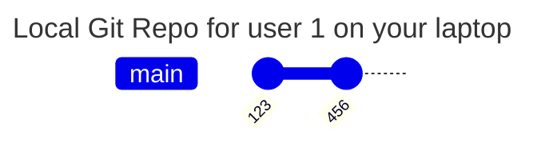
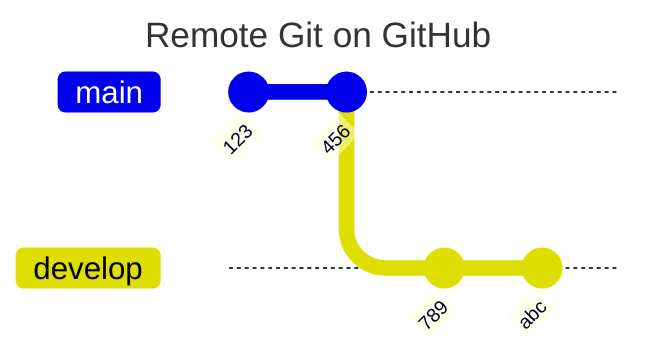

```mermaid
---
title: Local Git Repo for user 1 on your laptop
---
gitGraph
   commit id:"123"
   commit id:"456"
```

```mermaid
---
title: Remote Git on GitHub
---
gitGraph
   commit id:"123"
   commit id:"456"
   branch develop
   checkout develop
   commit id:"789"
   commit id:"abc"
```
