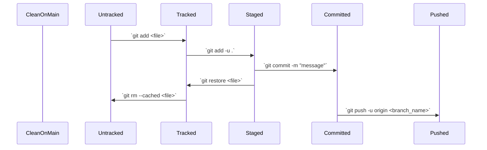

$ git commit -m "A test commit message to demonstrate the initial config, your message will be different."
[pham-week4 7b17c6a9] Added prisma schema from class on 1/29 and fixed up relations with npx prisma format.
 Committer: Ubuntu <ubuntu@ip-172-31-31-151.us-west-2.compute.internal>
Your name and email address were configured automatically based
on your username and hostname. Please check that they are accurate.
You can suppress this message by setting them explicitly. Run the
following command and follow the instructions in your editor to edit
your configuration file:

    git config --global --edit

After doing this, you may fix the identity used for this commit with:

    git commit --amend --reset-author

 5 files changed, 221 insertions(+), 18 deletions(-)
 create mode 100644 web-24wi/assignments/ppham/infra/api-server/README.md

### Pull Before Push


```
$ git push -u origin pham-week4
To github.com:TheEvergreenStateCollege/upper-division-cs.git
 ! [rejected]          pham-week4 -> pham-week4 (fetch first)
error: failed to push some refs to 'github.com:TheEvergreenStateCollege/upper-division-cs.git'
hint: Updates were rejected because the remote contains work that you do
hint: not have locally. This is usually caused by another repository pushing
hint: to the same ref. You may want to first integrate the remote changes
hint: (e.g., 'git pull ...') before pushing again.
hint: See the 'Note about fast-forwards' in 'git push --help' for details.
```

### Conflict Resolution

```
$ git pull origin pham-week4
remote: Enumerating objects: 18, done.
remote: Counting objects: 100% (18/18), done.
remote: Compressing objects: 100% (13/13), done.
remote: Total 18 (delta 9), reused 11 (delta 5), pack-reused 0
Unpacking objects: 100% (18/18), 5.93 KiB | 674.00 KiB/s, done.
From github.com:TheEvergreenStateCollege/upper-division-cs
 * branch              pham-week4 -> FETCH_HEAD
 * [new branch]        pham-week4 -> origin/pham-week4
hint: You have divergent branches and need to specify how to reconcile them.
hint: You can do so by running one of the following commands sometime before
hint: your next pull:
hint:
hint:   git config pull.rebase false  # merge (the default strategy)
hint:   git config pull.rebase true   # rebase
hint:   git config pull.ff only       # fast-forward only
hint:
hint: You can replace "git config" with "git config --global" to set a default
hint: preference for all repositories. You can also pass --rebase, --no-rebase,
hint: or --ff-only on the command line to override the configured default per
hint: invocation.
fatal: Need to specify how to reconcile divergent branches.
```


