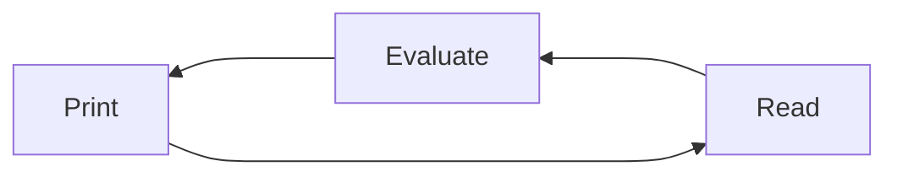

# Week 2 - Day 04
16 Jan 2024 - Tuesday

## First Hour

Mix of web infra and front-end today.

* A Review of HTTP GET
  * `curl` to simulate a browser requests
* [Starting Up GitHub Codespaces for Web Development](./Codespaces-Setup.md)
* Group Activity:
  * {20 minutes} classmates review [practice questions](./ReviewQuestions.md) in pairs
  * Read through [Readings](https://btholt.github.io/complete-intro-to-web-dev-v3)
* Review Readings / Watchings from HTML, CSS, and git
  * what questions do you have?
* Teaching staff practice interviewing each other
  * [10 minutes] practice [mock interview](./MockInterview.md) with each other.

* Continue working on Homeworks 01
* Teaching staff conduct mock interviews for students who are finished with HW1
  * all laps
* Javascript and NodeJS, via Nodeschool
  * reading in CSV and generating HTML


### What is the Difference Between UNIX and Linux?

The [history of Unix and operating systems is long and fascinating](https://en.wikipedia.org/wiki/History_of_Unix).
For the purpose of our class, we will treat Unix and Linux as
interchangeable and the same, and include with it Mac OS (which inherits from Unix through OpenBSD)
as well as Windows Powershell and Windows Subsystem for Linux (an optional download
that emulates the Linux kernel within the Windows operating system).

We will call these open computing standards everywhere simply "Unix", as in
"the Unix command-line", which refers to a character-based interface, or
*operating system shell*, which accepts commands from the user, executes processes,
returns results, and repeats in a Read-Evaluate-Print-Loop (REPL).



In MacOS school computers at Evergreen, `iTerm2` is a pre-installed program
to give you access to a Unix shell.

## Command-line Unix

The effect of commands usually depend on your *current working directory*,
sometimes just called "working directory". Many commands operate on files in
the working directory by default, and if you specify relative *paths*, 

In a Unix shell, you can get the current directory by typing the `pwd` command.
```
$ pwd
```
