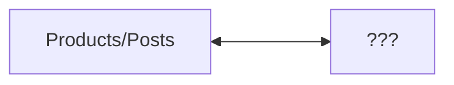

## All Laps

#### Reading
Read up to page 43 in Edward Tufte's ["The Visual Display of Quantitative Information"](https://archive.org/details/the-visual-display-of-quantitative-information-2ed-by-tufte-edward-r.-z-lib.org/mode/1up)
#### Prepare Your Response

There are two parts to your submission and one task after that
* A) Three examples of data visualizations that you choose from the reading
	* for each example:
		* what is compelling, useful, or interesting about it to you?
		* what is a website (give the URL) that demonstrates this type of data visualization?
		* say a sentence or two about the website you chose
* B) Three web interactions that you remember, adapt, or develop *offline* (do not do this with a computer yet)
	* for each example:
		* what about the interaction is compelling, useful, or interesting to you?
		* (now with a computer and your usual search tools, do this part *online*) what is a website (give the URL) that demonstrates the kind of web interaction that you imagined offline?
		* say a sentence or two about the website you choose
* C) Review a pull request that one of your classmates sends you about their co-creation. Read through their co-creation and try to go to all their suggested website URLs. Write a response as a pull request comment.

More details for each of these prompts appear below. Take your time, and develop each of your examples. Don't be afraid to sleep on it, revise, start from scratch, and discuss with classmates. The Web Infra homework is light for week 2 to give you time for co-creation. Here is a guide to balance your time between the assignments, for 12 hours of homework total for the Web Engineering tracks.

* 6 hours: Web Front End HW 2
* 3 hours: Web Infra HW 2
* 3 hours: Co-Creation HW 2
	* you may wish to time yourself on active thinking
	* at around 2h, transitioning from ideating / browsing will given you 1h to write and fully develop your idea for submission.

### A) Three Examples of Data Visualization, and an Axis
(You may read through the co-creations already in the Markdown file from your classmates so far.)

Pick two types of data visualizations from the reading that you find the most effective or interesting. Try to pick different ones than have already been chosen by your classmates. If you'd like to keep developing your dataset from Data Structures & Algorithms in Fall Quarter, pick data visualizations that you think are well-suited to that project, and answering questions from that dataset.

Look on the web, or ask your friends, for modern websites that are examples of those data visualizations.

Consider traditional product and social media websites as one end of a spectrum. These often display one post / one product as a rectangular card in a grid, that you can click on to view more details. What would be the other end of this spectrum? What would you call it and why? (There is no single "correct" answer). One end of the spectrum is not inherently "better" than the other. Also, there may be more than one axis; a multi-dimensional space of web interactions. If this appeals to you, say more about what the dimensions could be.

Include a description of your chosen axis with your co-creation sentences.

Then pick a third type of a data visualization that is suggested by, or is an extension, of one or more examples in the Tufte reading. It should be a kind of visualization that does not directly appear in the reading, and exists on the axis you just created. It can be close to the first two examples, or at any distance removed from them, on this axis.

As a fictitious example, let's say you picked from Tufte's reading "bar graph" and "pie chart". You find two websites "abc.com" and "def.info" that show interesting uses of bar graphs and pie charts. You might think the other end of the axis from product / social media is "food memes", and you might think a third example suggested by these two is some kind of spiral diagram. What might that look like, and what data might be well-suited to it? You might find a website "ghi.net" that shows a spiral diagram of a cinnamon bun, with the radial axis corresponding to how many pastries are consumed by Americans at different times of day, the angular axis. Is that far or close to the product / social media end of the spectrum, along the food meme axis? 

Don't worry if you don't have all the details, your ideas are still vague or in-development, or it doesn't make perfect sense. Consider aesthetic and other considerations as well as analytical ones, as well as what is fun for you to think about.

Add your response to the markdown file above. Remember, for Part A) your response will look like three paragraphs, each one following this form:

 * an example of a data visualization from the Tufte reading, with page number you found it on,
 * a website URL that you find online that resembles the data visualization,
 * remarks about that website with respect to the Tufte reading

### B) Three Examples of Web Interactions
(You may read through the co-creations already in the Markdown file from your classmates so far.)

Not all websites and web interactions are meant to convey a dataset. Some are purely aesthetic, entertainment, or something else entirely.

Think of three examples of interactions that you'd like to see on a website. It could be a website you've seen in the past, one that you dreamed about, or one that you are developing fresh for this assignment.

Write a few sentences in English about each example.

As in the previous example, then go search on the web, post in online forums or social media, or ask your friends in person, if they have heard of or seen websites similar to some aspects of what you've described.

Add your response to the markdown file above. Remember, 

### C) Review any Pull Requests Assigned to You
Check your GitHub inbox (in the top-right corner of the website github.com when you're logged in). A blue dot will mean you have new notifications, possibly of pull requests assigned to you. Click it to view.

This may take throughout the week for your classmates to finish their work and request your review. 

## What To Submit and Review 
In total, you will submit, as edits to the Markdown file:

For Part A) 3 paragraphs following this form
* an example of a data visualization from the Tufte reading, with page number you found it on,
 * a website URL that you find online that resembles the data visualization,
 * remarks about that website with respect to the Tufte reading

After that, for Part B) 3 paragraphs following this form:
*  an example of a web interaction that occurs to you while offline
* a website URL that you find online,
* remarks about that website with respect to the web interaction that you imagined

and create a Pull Request to add these 6 paragraphs to the monorepo.

Finally for Part C) you will assign this pull request to a classmate as a reviewer, to request a review.

Submit all your writing [in this one single Markdown file on the GitHub website](https://github.com/TheEvergreenStateCollege/upper-division-cs/blob/main/web-24wi/docs/week-02/Co-Creation-02.md)

_______________________________________________________________________________________________________________________________________________________________________________________________________________

##### Dee Dee
##### A) Three examples of data visualizations that you choose from the reading
###### Scatter plot/Bubble Graph
- Not to be boring but I love a good scatter plot, which wasn't represented in the reading other than as an example for outliers. Part of the reason I like them is exactly for that reason. Bubble graphs are also handy. Here's an example of a bubble graph data visualization representation: (https://informationisbeautiful.net/visualizations/worlds-biggest-data-breaches-hacks/)[https://informationisbeautiful.net/visualizations/worlds-biggest-data-breaches-hacks/]. I chose the informationisbeautiful site because the graphics are clean and modern. I think this particular data set will be useful for cybersecurity research and classes.

###### Choropleth Maps:
- The map of the count of galaxies is impressive and really drives home that we are a tiny blip of self importance. Here is a link to Warsaws 3D representation of the Milky Way and their findings: (https://www.space.com/milky-way-3d-map-warped-shape.html)[https://www.space.com/milky-way-3d-map-warped-shape.html]. I chose this website and example because I think it's a really cool example of how awesome graphically representing data is. Beyond the implications for science and understanding it's just an awesome project.

###### Before/After Time Series
- The before and after time series is also very effective in that without the intermediate data you see the starkness of the change. Here is an interesting example that tracks ocean plastic from space (watch the video if you want but there is  a two date comparison beneath it): (https://www.earthdata.nasa.gov/learn/articles/ocean-plastic)[https://www.earthdata.nasa.gov/learn/articles/ocean-plastic]. I chose this graphic data set because it applies both the subject mater over time and the  before and after data. I think this is impactful when you are trying to convey  that something is potentially getting worse or causing problems.

#### B) Three web interactions that you remember, adapt, or develop _offline_ (do not do this with a computer yet)

###### Community knowledge sharing
This interaction is appealing to me because it allows people to teach each other things and specifically, for communities, to utilize the specializations of its members to share information. It isn't always perfect but it almost is: (https://www.wikipedia.org/)[https://www.wikipedia.org/]. Wikipedia is usually my first stop for information gathering. I like it because for the amount of information, internal links, and external references. I also find opensource projects appealling. 

###### Collaborative work
I think real learning happens when people come together to solve problems and produce solutions. Being able to communicate effectively and keep track of threads, events, and assignments is an important and necessary workflow. A perfect site doesn't exist yet but the one I've seen used the most is: (https://slack.com/)[https://slack.com/]. I chose slack because I like it better than discord. It also has features like automating workflows and security.

###### Story telling
Who doesn't love a good story? There are many ways to convey a story and being able to do it visually on the web by immersing the user in your interface is an incredible. An example of a website that tells a visual story is: (https://uneminiaventure.fr/en#chap-01)[https://uneminiaventure.fr/en#chap-01]. I chose this site because it's purely entertaining and visually inspiring with no reason to experience it than to have a moment of thinking about websites differently. 
=======

To edit it from the website, click on the pencil icon in the upper-right corner. When it comes time to commit your changes, choose "Propose changes on a new branch" and then create a pull request with your changes. Request as a Reviewer one of your classmates. You can ask them in-person, or in Discord as well, if it's okay to request a review from them.

### Cassidy

## Part A

1. I like the visualization of cancer rates across the US (that sounds pretty dark ) on pages 17-19, as well as the other data maps. It seems to be a very effective way of visualizing data based on region because it's directly on a map of all the regions. A bar graph would have been able to show the same data, but have been much harder to understand without the surrounding context.

I think [this](https://ourworldindata.org/energy) page from Our World in Data is pretty cool. Could you imagine how horrific this would be with a bar graph?

2. The "before and after the collapse of a bridge on the Rhône in 1840" on page 36 is super cool. I would never think to graph the movement of a building. I would like to see a graph like this with something besides two data points. Maybe the Leaning Tower of Pisa?

Hey, that actually [exists](https://engineeringdiscoveries.com/leaning-tower-of-pisa/)! Well not quite, but this is also interesting. For the top graph, it's basically a bar graph representing the tower's height, but represented as the actual tower instead of a bar, which also increases the level of detail on display.

3. The "The life cycle of the Japanese beetle" graph on page 43 is by far my favorite. It's awesome because it manages to make it look like it's an instantaneous snapshot, even though it's over time.

[This](https://www.researchgate.net/figure/The-emergence-of-life-on-earth-during-geological-time-scales-along-with-temperature_fig1_337154054) site is somewhat similar, in that it shows the timescale in an almost instantaneous way.

## Part B

1. I like it when there's a central search bar for finding everything you need, especially when it's for documentation. It's nice to be able to find things without using an external search engine. Bonus points for having a keyboard shortcut. Example: https://dioxuslabs.com/learn/
2. Whenever a website has code snippets, I love when they have a convenient copy button, so I don't have to select-copy-paste manually. Another neat thing with code snippets on some websites, having a button to take me to a playground where I can compile the snippet. The Rust book website does both: https://doc.rust-lang.org/book/ch04-01-what-is-ownership.html 
3. Something I love on some websites is minimalism. A lot of modern websites have way to much crap going on, and too much iconography so I can't quite easily figure everything out. Some websites try to go in the opposite direction: https://tildes.net/

_________________________________________________________________________________________________________________________________________________________________________________________
## Nathan D - ndeanon25

### Part A) 

#### Data Maps 

I believe data maps provide help to an understanding of certain problems. The cancer data map is sad, but this type of data helps people visualize the situation. This could lead to helping avoid cancer and see what the communities that are significantly lower than U.S are doing to prevent this.  This website has interactive data maps https://flourish.studio/visualisations/maps/ is interesting because how the website is used. The data maps are interactive, and you can highlight what country to look at and it shows the GDP per capita and the population from 2022. It really is a great way to showcase the data and make it easier to enjoy. They have many different data map templates, and it is nice to see data like this rather than just table numbers.  

#### Time Series  

Time series graphs/plots are used to visualize and analyze data points collected or recorded over a continuous sequence of time intervals. They are particularly useful for tracking and understanding how data changes and evolves over time. They are interesting because they can be used for so many different applications. The one I have used the most is FRED. FRED is the federal reserve economic data, which relates to the U.S economy and financial markets. Here is the link, https://fred.stlouisfed.org/series/GFDEGDQ188S   ,of a time series that captures the Federal Debt, Total Public Debt as Percent of Gross Domestic Product. This website is a recognized and respected source, and it is a very valuable resource. They capture a lot of data, and you can basically look up any economic or financial time series plots that you could think of. They do this for not only the US, but other countries as well. For example, here is the link, which is a time series plot for the Net migration for Djibouti, https://fred.stlouisfed.org/series/SMPOPNETMDJI . 

#### Relational Graph 

I had to read more on the Relational Graph, since we were assigned until page 43, and this was on the last page. A relational graph is a visual representation of relationships or connections between entities or data points. This is interesting because we use this graph daily, for coding! This is basically dependency diagrams, so those UML are Relational Graphs. These graphs could also be used for Network Diagram.  Here in this link, https://www.geeksforgeeks.org/unified-modeling-language-uml-class-diagrams/ , they go UML and show the relationship between each class. They show relationships between classes and help visualize the code beforehand.   

### Part B)

The best web interaction is probably the control-f on documents. In my Google Drive, I have e-textbooks. Being able to look up certain words is amazing. Yes, you could look it up in the index at the back of the book, but this is more time-efficient and helps users find exactly what they are looking for.   

The other great thing about Google Drive is the cloud storage. Cloud storage is so helpful since we do not have to keep all our documents for school on a local device. The ability to work on different computers in grade school was great. I did not get my first laptop till college, and I could not take the school’s Chromebooks home, so Google Drive was a life saver.    

One of my favorite website interactions is the Apple website. When looking at certain products, as you scroll down, it seems like there is so much information and details about it. For example, here is the iPad pro website https://www.apple.com/ipad-pro/ . When you are scrolling down, you can see the words move but the iPad stays and then moves. While it does seem overwhelming, it still gives off a minimalistic vibe.   

_________________________________________________________________________________________________________________________________________________________________________________________
Riley (rilesbe)

PART A
The first visualization that caught my interest was the datamap of galaxies on page 26 and 27. Another resource that resembled this visualization, at least in my perspective, was this gmod map that came out recently called 2048 (https://steamcommunity.com/sharedfiles/filedetails/?id=3132262723). I find these different methods of data visualization to be interesting because of the sheer size of the data. The size is so big that it is incomprehensible to visualize, and besides acting as a representation of immense scale, offers no other metric in comparison.

The second visualization I took note of was the New York city weather time series on page 30. I found a few data maps on climate.gov (https://www.climate.gov/news-features/understanding-climate/us-climate-outlook-february-2024) that display weather data at a larger scale than just New York city. The visualizations I was able to find display data a bit differently, but are still informative in their own way. I appreciate the way the time-series displays the temperature not just as numbers but as a curve, showing how the weather changes every month. In comparison, the specific graphics I found on climate.gov gave information at a larger scale, the entire US. In addition, the data-map I found gave outlooks of whether specific regions of the US would see higher or lower temperatures than historic averages.

The last visualization I thought was worth noting was the time-series of Napoleon's army and their journey to Moscow on page 41. A visualization that had similar aspects that interested me was a graphic of the change in trade routes before and after the Panama Canal was created (https://www.researchgate.net/figure/Shortest-trade-route-provided-by-the-Panama-Canal-Adapted-from-Council-for-Economic_fig1_224208970). What I like about both of these graphics is the way it tells a detailed story in a purely visual way. It’s like an alternative way to learn about historical events. I do believe that the visualization from the Tufte reading does a better job at telling a story, but I do appreciate what both offer in terms of story-telling.

PART B
A web interaction that came to mind was my cousin’s earring business’s website: Hoops and Holes (https://hoopsandholes.com/). I was pretty interested when he showed it to me, the concept is that there are no clickable links that lead you to anything, just an endless repeating grid of his earrings. All of the earring images are actually gifs that rotate, and you can zoom in and out of the page. When I saw this, I first thought that he had somehow created a fractal, that if you zoomed in enough then you would be able to see a smaller earring and then another earring. I realize that this would probably be computationally impossible, but I do really enjoy this idea of displaying items on a webpage.

Another interaction that came to mind was using puzzles in some way to navigate the website. This of course wouldn’t be practical or the most user-friendly, but I imagine a similar interaction to this one I Spy computer game I would play as a kid (Link to YouTube longplay I watch for nostalgia: https://www.youtube.com/watch?v=peWemzv18JA&t=530s). You would navigate through a spooky mansion through clicking on objects, and would piece together hidden objects to get out of the mansion. I don’t really know of a website that has this functionality, as it kind of goes against a lot of what is usually wanted in user experience design.
	
Lastly, an interaction I think would be interesting was being able to move buttons/navigation around for the benefit of the user. Adding personal customization to a website isn’t really possible directly in the website itself, so giving the user more power in that way could lead to some cool creations. The only real customization I can think about that is built into websites now is the ability to change the theme, most commonly between dark and light mode.

