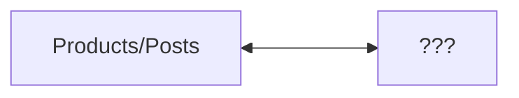

## All Laps

#### Reading
Read up to page 43 in Edward Tufte's ["The Visual Display of Quantitative Information"](https://archive.org/details/the-visual-display-of-quantitative-information-2ed-by-tufte-edward-r.-z-lib.org/mode/1up)
#### Prepare Your Response

There are two parts to your submission and one task after that
* A) Three examples of data visualizations that you choose from the reading
	* for each example:
		* what is compelling, useful, or interesting about it to you?
		* what is a website (give the URL) that demonstrates this type of data visualization?
		* say a sentence or two about the website you chose
* B) Three web interactions that you remember, adapt, or develop *offline* (do not do this with a computer yet)
	* for each example:
		* what about the interaction is compelling, useful, or interesting to you?
		* (now with a computer and your usual search tools, do this part *online*) what is a website (give the URL) that demonstrates the kind of web interaction that you imagined offline?
		* say a sentence or two about the website you choose
* C) Review a pull request that one of your classmates sends you about their co-creation. Read through their co-creation and try to go to all their suggested website URLs. Write a response as a pull request comment.

More details for each of these prompts appear below. Take your time, and develop each of your examples. Don't be afraid to sleep on it, revise, start from scratch, and discuss with classmates. The Web Infra homework is light for week 2 to give you time for co-creation. Here is a guide to balance your time between the assignments, for 12 hours of homework total for the Web Engineering tracks.

* 6 hours: Web Front End HW 2
* 3 hours: Web Infra HW 2
* 3 hours: Co-Creation HW 2
	* you may wish to time yourself on active thinking
	* at around 2h, transitioning from ideating / browsing will given you 1h to write and fully develop your idea for submission.

### A) Three Examples of Data Visualization, and an Axis
(You may read through the co-creations already in the Markdown file from your classmates so far.)

Pick two types of data visualizations from the reading that you find the most effective or interesting. Try to pick different ones than have already been chosen by your classmates. If you'd like to keep developing your dataset from Data Structures & Algorithms in Fall Quarter, pick data visualizations that you think are well-suited to that project, and answering questions from that dataset.

Look on the web, or ask your friends, for modern websites that are examples of those data visualizations.

Consider traditional product and social media websites as one end of a spectrum. These often display one post / one product as a rectangular card in a grid, that you can click on to view more details. What would be the other end of this spectrum? What would you call it and why? (There is no single "correct" answer). One end of the spectrum is not inherently "better" than the other. Also, there may be more than one axis; a multi-dimensional space of web interactions. If this appeals to you, say more about what the dimensions could be.

Include a description of your chosen axis with your co-creation sentences.

Then pick a third type of a data visualization that is suggested by, or is an extension, of one or more examples in the Tufte reading. It should be a kind of visualization that does not directly appear in the reading, and exists on the axis you just created. It can be close to the first two examples, or at any distance removed from them, on this axis.

As a fictitious example, let's say you picked from Tufte's reading "bar graph" and "pie chart". You find two websites "abc.com" and "def.info" that show interesting uses of bar graphs and pie charts. You might think the other end of the axis from product / social media is "food memes", and you might think a third example suggested by these two is some kind of spiral diagram. What might that look like, and what data might be well-suited to it? You might find a website "ghi.net" that shows a spiral diagram of a cinnamon bun, with the radial axis corresponding to how many pastries are consumed by Americans at different times of day, the angular axis. Is that far or close to the product / social media end of the spectrum, along the food meme axis? 

Don't worry if you don't have all the details, your ideas are still vague or in-development, or it doesn't make perfect sense. Consider aesthetic and other considerations as well as analytical ones, as well as what is fun for you to think about.

Add your response to the markdown file above. Remember, for Part A) your response will look like three paragraphs, each one following this form:

 * an example of a data visualization from the Tufte reading, with page number you found it on,
 * a website URL that you find online that resembles the data visualization,
 * remarks about that website with respect to the Tufte reading

### B) Three Examples of Web Interactions
(You may read through the co-creations already in the Markdown file from your classmates so far.)

Not all websites and web interactions are meant to convey a dataset. Some are purely aesthetic, entertainment, or something else entirely.

Think of three examples of interactions that you'd like to see on a website. It could be a website you've seen in the past, one that you dreamed about, or one that you are developing fresh for this assignment.

Write a few sentences in English about each example.

As in the previous example, then go search on the web, post in online forums or social media, or ask your friends in person, if they have heard of or seen websites similar to some aspects of what you've described.

Add your response to the markdown file above. Remember, 

### C) Review any Pull Requests Assigned to You
Check your GitHub inbox (in the top-right corner of the website github.com when you're logged in). A blue dot will mean you have new notifications, possibly of pull requests assigned to you. Click it to view.

This may take throughout the week for your classmates to finish their work and request your review. 

## What To Submit and Review 
In total, you will submit, as edits to the Markdown file:

For Part A) 3 paragraphs following this form
* an example of a data visualization from the Tufte reading, with page number you found it on,
 * a website URL that you find online that resembles the data visualization,
 * remarks about that website with respect to the Tufte reading

After that, for Part B) 3 paragraphs following this form:
*  an example of a web interaction that occurs to you while offline
* a website URL that you find online,
* remarks about that website with respect to the web interaction that you imagined

and create a Pull Request to add these 6 paragraphs to the monorepo.

Finally for Part C) you will assign this pull request to a classmate as a reviewer, to request a review.

Submit all your writing [in this one single Markdown file on the GitHub website](https://github.com/TheEvergreenStateCollege/upper-division-cs/blob/main/web-24wi/docs/week-02/Co-Creation-02.md)
To edit it from the website, click on the pencil icon in the upper-right corner. When it comes time to commit your changes, choose "Propose changes on a new branch" and then create a pull request with your changes. Request as a Reviewer one of your classmates. You can ask them in-person, or in Discord as well, if it's okay to request a review from them.To edit it from the website, click on the pencil icon in the upper-right corner. When it comes time to commit your changes, choose "Propose changes on a new branch" and then create a pull request with your changes. Request as a Reviewer one of your classmates. You can ask them in-person, or in Discord as well, if it's okay to request a review from them.To edit it from the website, click on the pencil icon in the upper-right corner. When it comes time to commit your changes, choose "Propose changes on a new branch" and then create a pull request with your changes. Request as a Reviewer one of your classmates. You can ask them in-person, or in Discord as well, if it's okay to request a review from them.To edit it from the website, click on the pencil icon in the upper-right corner. When it comes time to commit your changes, choose "Propose changes on a new branch" and then create a pull request with your changes. Request as a Reviewer one of your classmates. You can ask them in-person, or in Discord as well, if it's okay to request a review from them.To edit it from the website, click on the pencil icon in the upper-right corner. When it comes time to commit your changes, choose "Propose changes on a new branch" and then create a pull request with your changes. Request as a Reviewer one of your classmates. You can ask them in-person, or in Discord as well, if it's okay to request a review from them.To edit it from the website, click on the pencil icon in the upper-right corner. When it comes time to commit your changes, choose "Propose changes on a new branch" and then create a pull request with your changes. Request as a Reviewer one of your classmates. You can ask them in-person, or in Discord as well, if it's okay to request a review from them.

### Cassidy

## Part A

1. I like the visualization of cancer rates across the US (that sounds pretty dark ) on pages 17-19, as well as the other data maps. It seems to be a very effective way of visualizing data based on region because it's directly on a map of all the regions. A bar graph would have been able to show the same data, but have been much harder to understand without the surrounding context.

I think [this](https://ourworldindata.org/energy) page from Our World in Data is pretty cool. Could you imagine how horrific this would be with a bar graph?

2. The "before and after the collapse of a bridge on the Rhône in 1840" on page 36 is super cool. I would never think to graph the movement of a building. I would like to see a graph like this with something besides two data points. Maybe the Leaning Tower of Pisa?

Hey, that actually [exists](https://engineeringdiscoveries.com/leaning-tower-of-pisa/)! Well not quite, but this is also interesting. For the top graph, it's basically a bar graph representing the tower's height, but represented as the actual tower instead of a bar, which also increases the level of detail on display.

3. The "The life cycle of the Japanese beetle" graph on page 43 is by far my favorite. It's awesome because it manages to make it look like it's an instantaneous snapshot, even though it's over time.

[This](https://www.researchgate.net/figure/The-emergence-of-life-on-earth-during-geological-time-scales-along-with-temperature_fig1_337154054) site is somewhat similar, in that it shows the timescale in an almost instantaneous way.

## Part B

1. I like it when there's a central search bar for finding everything you need, especially when it's for documentation. It's nice to be able to find things without using an external search engine. Bonus points for having a keyboard shortcut. Example: https://dioxuslabs.com/learn/
2. Whenever a website has code snippets, I love when they have a convenient copy button, so I don't have to select-copy-paste manually. Another neat thing with code snippets on some websites, having a button to take me to a playground where I can compile the snippet. The Rust book website does both: https://doc.rust-lang.org/book/ch04-01-what-is-ownership.html 
3. Something I love on some websites is minimalism. A lot of modern websites have way to much crap going on, and too much iconography so I can't quite easily figure everything out. Some websites try to go in the opposite direction: https://tildes.net/
