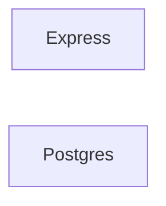
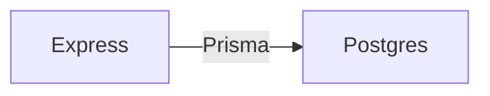

# Web Infrastructure - Homework 02

All students are asked to do Lap 1 in order to set up and make progress on your AWS server and infrastructure for their final project.

Students interested in Rust may do Lap 2 or Lap 3 (or both).

Our goal in this homework is
* For Lap 1:
	* To begin to complement our front-end work by creating our own API (Application Programming Interface), a series of REST endpoints that we can call to transfer data, starting with the GET method.
	* To learn about databases, and how they can make data available to front ends, as an alternative to the CSV files that you may have gathered and processed in Data Structures & Algorithms last quarter.
* For Lap 2:
	* To learn how structs, pattern matching, and enum help Rust group data together, and also response to, and parse, typed data in an elegant way borrowed from functional programming.
	* To solidify that understanding, along with ownership and string slices, through a small project to implement a bounded-depth HTTP crawler.
* For Lap 3:
	* To begin exploring WebAssembly and Rust by making a web app that allows native performance by using HTML/CSS/JS to load wasm into a user's browser, seamlessly and with no technical knowledge.

## Lap 1: Cloud

#### Readings

Read and/or watch the first two sections of API design with NodeJS and Express

Some short notes
https://hendrixer.github.io/API-design-v4/

Video Accompanying the Above with More Details
https://frontendmasters.com/courses/api-design-nodejs-v4/

Read and/or watch the first two sections of "Introduction to SQL and Postgres"
https://frontendmasters.com/courses/sql/

Watch Sections 4 and 5 of [Full Stack for Front-End Engineers](https://frontendmasters.com/courses/fullstack-v3/):
* Operating Systems
* How The Internet Works
Ignore the section in "Operating Systems" where it discusses adding your SSH key to a Digital Ocean droplet. We've already added an SSH key to our AWS EC2 instance.

From these readings, we will learn the P, the E, and the N, of the so-called PERN stack. Lap 2 students of the Front-End track are learning the R (React), but React is not necessary for the PEN part of the stack to serve dynamic web apps. In fact, before React came along, all stacks were like the PEN stack, and various rendering libraries tried to solve different pieces of the web component problem to various degrees of success.
### Tasks
Create a subdirectory in the assignments directory on your AWS server to hold your 

As guided through your readings, you will be running two minimal backend components:
* a REST server with Express (written in Javascript, that you've been learning in Front-End)
* a Database (Postgres) inside a Docker container

These will remain separate during this assignment.




In the next assignment, we will connect from the Express REST server to Postgres in the Docker container, using an Object Relational Mapping (ORM) library called Prisma. It will then look something like




You can read ahead to Section 3 of the Node API course if you are interested.


In the future, the Node API course may refer to a Postgres database hosted at Render.com. For your own reference, we will instead be using a Postgres database that we host ourselves on our AWS server. This will save on creating a new account, give us greater data capacity and privacy, and teach other valuable skills such as backing up and restoring our own databases as needed.

## Lap 2: Rust

### Reading

[Rust Book: Chapter 05 - Structs](https://rust-book.cs.brown.edu/ch05-00-structs.html)

[Rust Book: Chapter 06 - Enums, Pattern Matching](https://rust-book.cs.brown.edu/ch06-00-enums.html)

In your personal assignments directory, you will write a program that acts as a simple web crawler plus indexer and add and commit it there. Create a cargo project there

```
cd <repo_root>/web-24wi/assignments/<github_username>/rust
cargo new week2
```

The program should take a start URL, a search term, and a maximum depth to crawl. In your Cargo project, it should be possible to run it in the following way, after building it with `cargo run`

```
./target/debug/<binary_name> <start_url> <search_term> <max_depth>
```
add and commit a program that makes an HTTP get command to a URL of your choice. The program should store the responses of each crawl in a Struct including
	* HTTP response headers
	* HTTP response code
	* a response body
	* a `Vec` of outgoing URLs to crawl next

It will be necessary to parse the HTTP response to populate this `Struct`. You may use the [`http`](https://docs.rs/http/latest/http/) crate or any other library of your choice. Crawling starting with the `start_url` counts as depth 1, and outgoing URLs from this page count as crawling depth 2, and so on. You are asked to crawl up to *and including* the max_depth. You're promised that the `max_depth` will always be a positive integer.

Don't worry about cycles / loops. The `max_depth` will prevent crawling infinitely.

Include a short discussion in a README.md file about your design choices, challenges faced, and how you applied your learning on Ownership, Structs, Enums, and Pattern Matching from this week's reading and last week.

Don't worry if you don't finish. Timebox your efforts at 6 hours, commit what you have, and describe your work-in-progress and what steps you would take next if you were to spend more time on it.

### Lab 3: Rust + WebAssembly

If you have already completed the Rust book and the two projects within it (command-line grep tool and multithreaded web server), you are invited to deploy a web app compiled from Rust into WebAssembly, of your own choice.

One suggestion is to consider a WebGL app for rendering simple graphics. Deploy a demo to your AWS server, and commit the source code into the monorepo under a `week2` directory. The goal is to use Javascript / HTML / CSS as a shim to load your wasm app.

Include a README.md file describing what you learned, any tutorials that you followed, key snippets of code, challenges you encountered, and design / implementation choices that you made.