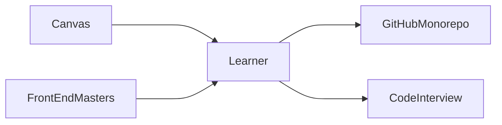

# Week 03 - Day 08
25 Jan 2024 - Thursday

## Web Front-End Morning Session

Workflow for Studying and Assignments

* Final Project Design
  * In DSA, it was answering a question on a dataset
    * Gathered by hand, crawled, or downloaded a CSV
    * Now, we are learning how to automate it by calling APIs
  * In WEB, it is creating a user interaction that you imagine, or see on the web
    * you want it to be appealing for, serve, or entertain at least some community
    * your end goal is to publish the demo at a public domain and gather user statistics
    * you want to be pulled by the desire to make it real
    * Visualizing a Public API
    * Creating Web Art
      * [CodePen Gallery](https://codepen.io/spark)
      * [ThreeJS Fiber Examples](https://docs.pmnd.rs/react-three-fiber/getting-started/examples)
  * [Co-Creation 02 Assignment on Canvas](https://canvas.evergreen.edu/courses/6249/assignments/114348)
  * [The Visual Display of Quantitative Information](https://archive.org/details/the-visual-display-of-quantitative-information-2ed-by-tufte-edward-r.-z-lib.org/mode/1up)
    * Data from [Minerd's Napoleon march to Moscow](https://www.cs.uic.edu/~wilkinson/TheGrammarOfGraphics/minard.txt).

* Model-View-Controller (MVC) Paradigm
  * Data model: what is the seed / bare bones data, what is persisted in SSD / storage, the database schema
  * View: what HTML tags to generate and how to style them (CSS)
  * Controller: the brain that ties the two of them together

  * What parts of MVC run on front-end versus on infrastructure?
  * How does it change with a React app?
  * How does it change with server-side render (like Preact)?
  * What are the pros and cons of using MVC, with or without React?
    * also consider how this affects working on a large website, with multiple engineers 
  * Can you use React without MVC?

* Dissecting a Web Interaction
  * the product axis: open any of the FAANG websites or similar
  * with a partner:
    * open page source
    * imagine generating the tags, styles, script files by hand.
    * what loops are needed?
    * what is in the body of the loops

## Web Infra Afternoon Session

### Improvements and Mindset

You have the mindset of a contributor, to a team of engineers.
[View monorepo issues]() to work on.

You are invited to consider yourself doing the following
* add to the monorepo's instructions
* respond to other's issues with comments, questions, clarifications
* think about tone and conduct of writing: we are all here to learn, and to help others learn

As we go through the remaining activities, keep in mind anything that doesn't work
the way you expect.

This is not a necessarily good or bad thing. Notice any thoughts, feelings, and
judgments arising. We will create a new issue by the end.

### Running Our Own API

* Demonstrate the desired end result of fetching from an Express API

Use the readings / notes from 
* Setting up docker

### Database Design

* Demonstrate the end result of fetching from an Express API with a database

* Install `docker` and `Postgres`
  * follow the [Week 3 from our AWS Cloud Server in progress]

### Add a New Issue

With a partner, create a new GitHub issue based on your experiences
and your reflection at the beginning.

### Improvements and Mindset

You have the mindset of a contributor, to a team of engineers.
[View monorepo issues]() to work on.

You are invited to consider yourself doing the following
* add to the monorepo's instructions
* respond to other's issues with comments, questions, clarifications
* think about tone and conduct of writing: we are all here to learn, and to help others learn

As we go through the remaining activities, keep in mind anything that doesn't work
the way you expect.

This is not a necessarily good or bad thing. Notice any thoughts, feelings, and
judgments arising. We will create a new issue by the end.
