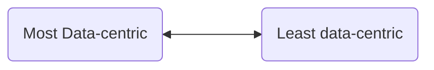

# Web Final Project HW 05
(100 points)

As we pass Week 05, your outside-of-class time will be directed more and more to your final project through guided checkpoints, like this one, and less and less to homeworks. 

[Final projects will follow the guidelines here](../../FinalProject.md).

## 1. Think and Draw (Turn in three sheets of paper)
(50 points)

Similar to what we did in class on Thursday, Feb 1st: prepare a userflow diagram and two wireframe diagrams for your proposed final project. You will present this at a practice demo day to get feedback from teaching staff and classmates and also find potential teammates. You will do these on blank 8.5"x11" sheets of white paper and bring them to class to hand in. More guidelines are below.

You may think of your final project as on a scale, from most product / data centric, to least product / post centric, using your work from [Co-Creation-02 homework](../week-02/Co-Creation-02.md) .

Some of you may be drawn to Web Art, such as the examples on CodePen's gallery, which is based more on aesthetics, mathematics, randomness, or other chaotic factors. All kinds of projects are welcome and acceptable.

You will want to choose something that is interesting and exciting to you.
### 1a. Userflow Diagram (1 sheet of paper)
![[Pasted image 20240205184806.png]]
![[Pasted image 20240205184856.png]]
1. Pair up with a potential project teammate if you have one. (You don't have to commit to being on the same team at this time.) Doing this alone is also okay. Begin with one blank 8.5"x11" sheet of white paper.
2. Sketch out thumbnails (a small less detailed version) of at least three different page types for your app and how they are related. This is a roadmap of how the two or three page types interact at a 10,000 foot view. Pretend you are in an airplane looking down, or are in "Creator mode" of the universe. Draw mini buttons, form inputs, images, etc. that are important to each page. Don't worry about making it perfect, just capture the essence of the interaction you like. 
3. Draw arrows to show how the user visits the page types and in which order.
	1. For some websites, each page type has a *route*, and you click or otherwise interact to move from one page type to another.
		1. For example, Google has two big page types
			1. `/` is the route for the Landing Page
			2. `/search` is the "Search Results Page"
	2. For other websites, the page types may different phases in an animation, movie, music, game, or other process.

### 1b. Wireframe Diagrams [2 sheets of paper]
Pick two of the page types on your userflow. For each one, you will draw a *wireframe diagram*

![[Pasted image 20240205183427.png]]

![[Pasted image 20240205183635.png]]
 1. A wireframe diagram is a zoomed-in, "10 foot" view of a page type from your userflow diagram, with enough detail of how text, buttons, images, etc. are placed relative to each other, that a front-end engineer (other than you) could recreate it (roughly) in HTML, CSS, and JS. It basically represents what you see in your web browser, when you go to that part of the website, represented on one sheet of paper.
 2. If text is large, bold, underlined, etc. draw it as such. You can draw empty outlines with a text description of what an image should be. If there are input forms or search boxes, draw them as well.
 3. Put at least two post-it notes on clickable / hoverable elements and describe what happens when the user interacts with them.
	 * For example, on a Google Search Results page
		 * each search result will have a clickable title, a last updated time, a URL, and the surrounding text context of a search term.
		 * One post-it note per clickable search result should say "when clicked, takes user to abc.com" or the appropriate URL for that search result.

## Practice Demo Day
(50 points)

On Thursday morning, Feb 8th, at 10am, we will have the following activities, during our normal Web Front-End class time. It will be organized by the TAs, who will divide the class into two shifts, just like the real Demo Day at the end of Week 10.

You will log into your computers as normal, but treat it as a "Shop Window" where you are open to business during either the first shift (Shift A) or the second shift (Shift B), presenting to potential teammates and ask for feedback. "Customers", or potential teammates, will come by to talk to you about your idea, and filling out feedback forms. 

* 15 minute introduction, everyone logs in and prepares their "Shop Window"
* 45 minutes: Shift A is "open for business" at their "shop windows",
	* Shift B moves around and are feedback customers
* 45 minutes: Shift B is "open for business" at their shop windows,
	* Shift A moves around and are feedback customers
* 15 minutes: everyone finishes up feedback forms, debrief, conclusion

