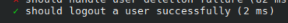
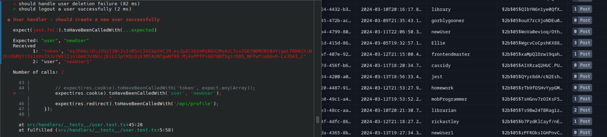
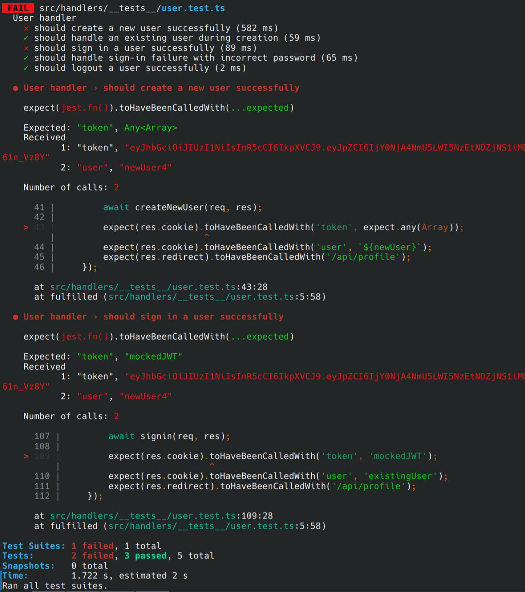

# 3.13.24

We spend a long time researching and attempting to run unit tests. Oddly, the tests seem to work, from a database 
perspective but fail in the terminal.

Here is an example of a test:
``` javascript
    // logout
    it('should logout a user successfully', async () => {
        const req = {};
        const res = {
            clearCookie: jest.fn(),
            redirect: jest.fn(),
        };

        await logout(req, res);

        expect(res.clearCookie).toHaveBeenCalledWith('user');
        expect(res.clearCookie).toHaveBeenCalledWith('token');
        expect(res.redirect).toHaveBeenCalledWith('/');
    });
```

When wrote a total of 5 tests based on our learnings from the Node.js API Frontend Master's class, as well as some 
outside research. Running the test the first time resulted in one test passing and the others failing.

The only successful test was logging out, we assume because the tests were never able to log in.



We decided to focus on the first test which is to create a new user successfully. We discovered that a user was being
created on the database side but wasn't being acknowledged by the test. We were never able to get this test to succeed,
even though we were able to create a new user with the test.




We decided to change the way we were giving the tests usernames and passwords. Namely, we decided to declare variables
at the top of the document, and give the test functions the variables-rather than hard code them in. This lessened
our confusion by making the code more readable, and made finding variable issues easier. 
It turns out that was part of the problem. We were trying to create a new user with a username and password that had 
already been used (the user already existed in the database). 



We weren't very excited to find this mistake and took a short break to make fun of ourselves. Running the tests again, 
it returned 3 successes and 2 failures.

#### Success:
    'Should handle an existing user during creation'
    'Should handle sign-in failure with incorrect password'
    'Should logout a user successfully'

#### Failure:
    'should create a new user successfully'
    'should signin a user successfully'


Not great. This functionality works on in the web app and is handled correctly by the API. We understand that the fault
mush be in the testing logic. We ran out of time trying to get this to work yesterday, and are presenting our project 
today so won't have time to get it working appropriately. 

We are hopeful that after a much-needed break from this project we can revisit it with fresh eyes. We have had a great
time working together and creating and look forward to future projects together. We're also ready for a restorative 
Spring break.